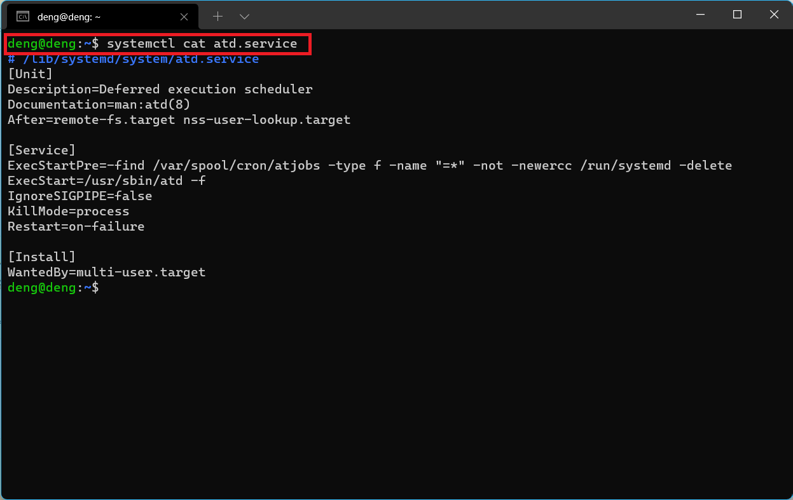
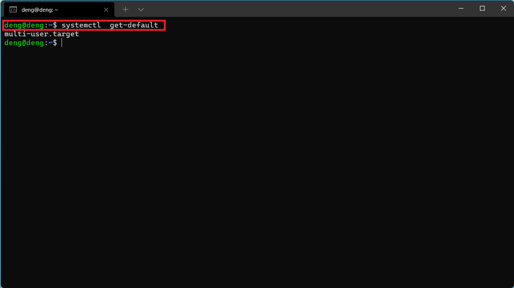
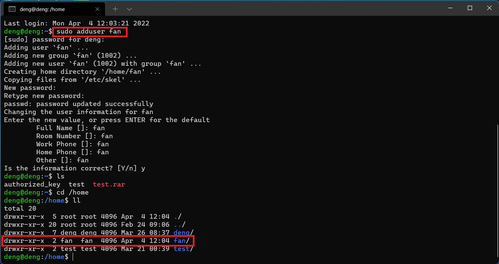
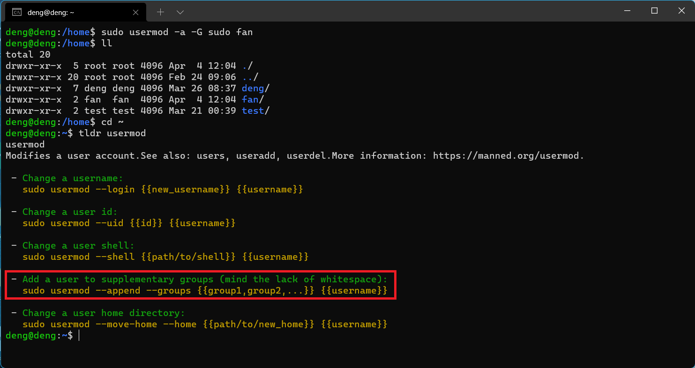
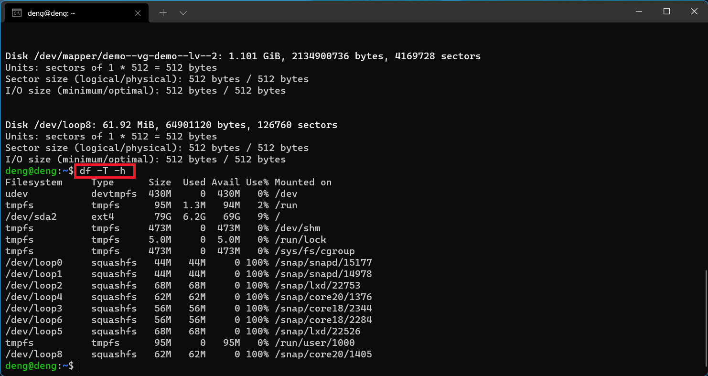
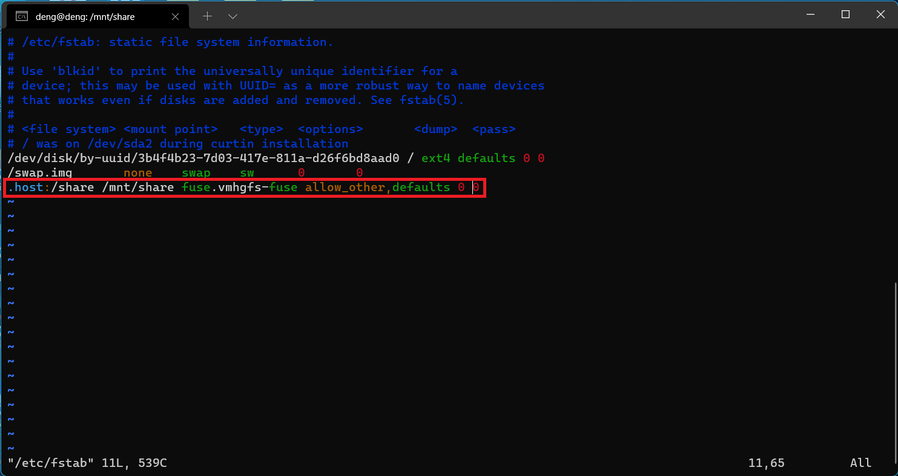
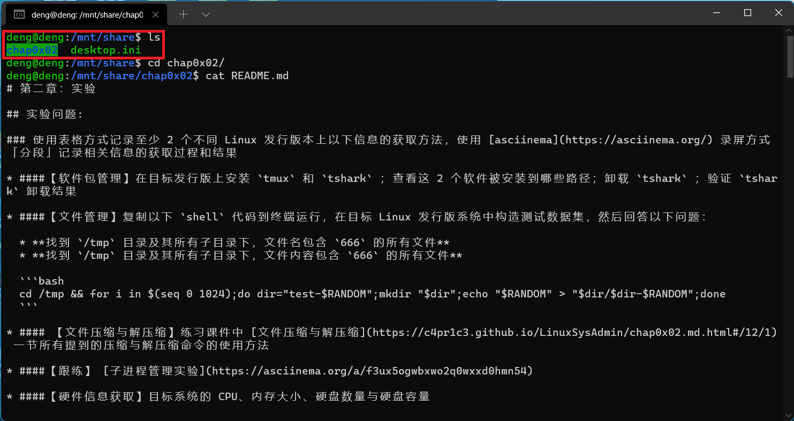

# 第三章：实验

## 实验问题

* [Systemd 入门教程：命令篇](http://www.ruanyifeng.com/blog/2016/03/systemd-tutorial-commands.html)

* [Systemd 入门教程：实战篇](http://www.ruanyifeng.com/blog/2016/03/systemd-tutorial-part-two.html)

* 自查清单

  - 如何添加一个用户并使其具备sudo执行程序的权限？
  - 如何将一个用户添加到一个用户组？
  - 如何查看当前系统的分区表和文件系统详细信息？
  - 如何实现开机自动挂载VMware Workstation的共享目录分区？
  - 基于LVM（逻辑分卷管理）的分区如何实现动态扩容和缩减容量？
  - 如何通过systemd设置实现在网络连通时运行一个指定脚本，在网络断开时运行另一个脚本？
  - 如何通过systemd设置实现一个脚本在任何情况下被杀死之后会立即重新启动？实现**杀不死**？

## 实验环境
- VMware Workstation
- Ubuntu 20.04.2 LTS

## 问题解答

1. ###[Systemd 入门教程：命令篇](http://www.ruanyifeng.com/blog/2016/03/systemd-tutorial-commands.html)

   1. ####系统管理

      1. **systemctl**

         `systemctl`是Systemd的主命令，用于系统管理。

         ```bash
         # 重启系统
         $ sudo systemctl reboot
         
         # 关闭系统，切断电源
         $ sudo systemctl poweroff
         
         # CPU停止工作
         $ sudo systemctl halt
         
         # 暂停系统
         $ sudo systemctl suspend
         
         # 让系统进入冬眠状态
         $ sudo systemctl hibernate
         
         # 让系统进入交互式休眠状态
         $ sudo systemctl hybrid-sleep
         
         # 启动进入救援状态（单用户状态）
         $ sudo systemctl rescue
         ```

      2. **systemd-analyze**

         `systemd-analyze`命令用于查看启动耗时。

         ```bash
         # 查看启动耗时
         $ systemd-analyze                                                                                       
         # 查看每个服务的启动耗时
         $ systemd-analyze blame
         
         # 显示瀑布状的启动过程流
         $ systemd-analyze critical-chain
         
         # 显示指定服务的启动流
         $ systemd-analyze critical-chain atd.service
         ```

         具体操作步骤如下：

         [](https://asciinema.org/a/aF905FuVZ1mZZNYIkLBVrh0P8)

      3. **hostnamectl**

         `hostnamectl`命令用于查看当前主机的信息。 

         ```bash
         # 显示当前主机的信息
         $ hostnamectl
         
         # 设置主机名。
         $ sudo hostnamectl set-hostname cuc
         ```

         具体操作步骤如下：

         [](https://asciinema.org/a/EUSR6COZ449wNlTZfyMlPlmTt)

      4. **localectl**

         `localectl`命令用于查看本地化设置。 

         ```bash
         # 查看本地化设置
         $ localectl
         
         # 设置本地化参数。
         $ sudo localectl set-locale LANG=en_GB.utf8
         $ sudo localectl set-keymap en_GB
         ```

         具体操作步骤如下：

         [](https://asciinema.org/a/oo3NzROVZxzaB4dErxFKR4QWJ)

      5. **timedatectl**

         `timedatectl`命令用于查看当前时区设置。 

         ```bash
         # 查看当前时区设置
         $ timedatectl
         
         # 显示所有可用的时区
         $ timedatectl list-timezones                                                                                   
         # 设置当前时区
         $ sudo timedatectl set-timezone America/New_York
         $ sudo timedatectl set-time YYYY-MM-DD
         $ sudo timedatectl set-time HH:MM:SS
         ```

         具体操作步骤如下：

         [](https://asciinema.org/a/P0yBw7Xgqg5f6YEoVQOqOHTyN)

      6. **loginctl**

         `loginctl`命令用于查看当前登录的用户。 

         ```bash
         # 列出当前session
         $ loginctl list-sessions
         
         # 列出当前登录用户
         $ loginctl list-users
         
         # 列出显示指定用户的信息
         $ loginctl show-user deng
         ```

         具体操作步骤如下：

         [](https://asciinema.org/a/SlcqtHTdPEeijDDsHmGJZo8g8)

   2. #### Unit

      1. **Unit的含义**

         Systemd 可以管理所有系统资源。不同的资源统称为 Unit（单位）。Unit 一共分成12种。

         ```wiki
         Service unit：系统服务
         Target unit：多个 Unit 构成的一个组
         Device Unit：硬件设备
         Mount Unit：文件系统的挂载点
         Automount Unit：自动挂载点
         Path Unit：文件或路径
         Scope Unit：不是由 Systemd 启动的外部进程
         Slice Unit：进程组
         Snapshot Unit：Systemd 快照，可以切回某个快照
         Socket Unit：进程间通信的 socket
         Swap Unit：swap 文件
         Timer Unit：定时器
         ```

         `systemctl list-units `命令可以查看当前系统的所有 Unit 。 

         ```bash
         # 列出正在运行的 Unit
         $ systemctl list-units
         
         # 列出所有Unit，包括没有找到配置文件的或者启动失败的
         $ systemctl list-units --all
         
         # 列出所有没有运行的 Unit
         $ systemctl list-units --all --state=inactive
         
         # 列出所有加载失败的 Unit
         $ systemctl list-units --failed
         
         # 列出所有正在运行的、类型为 service 的 Unit
         $ systemctl list-units --type=service
         ```

         具体操作步骤如下：

         [](https://asciinema.org/a/UfVzsZFtNdhgM2xxSmh3PkgUc)

      2. **Unit 的状态**

         `systemctl status`命令用于查看系统状态和单个 Unit 的状态。 

         ```bash
         # 显示系统状态
         $ systemctl status
         
         # 显示单个 Unit 的状态
         $ systemctl status sshd.service
         
         # 显示远程主机的某个 Unit 的状态
         $ systemctl -H deng@192.168.88.131 status sshd.service
         ```

         除了`status`命令，`systemctl`还提供了三个查询状态的简单方法，主要供脚本内部的判断语句使用。 

         ```bash
         # 显示某个 Unit 是否正在运行
         $ systemctl is-active sshd.service
         
         # 显示某个 Unit 是否处于启动失败状态
         $ systemctl is-failed sshd.service
         
         # 显示某个 Unit 服务是否建立了启动链接
         $ systemctl is-enabled sshd.service
         ```

         具体操作步骤如下：

         [](https://asciinema.org/a/uScDWxLFEz5W5ErOaUqNuwyWk)

      3. **Unit 管理**

         对于用户来说，最常用的是下面这些命令，用于启动和停止 Unit（主要是 service）。 

         ```bash
         # 立即启动一个服务
         $ sudo systemctl start apache2.service
         
         # 立即停止一个服务
         $ sudo systemctl stop apache2.service
         
         # 重启一个服务
         $ sudo systemctl restart apache2.service
         
         # 杀死一个服务的所有子进程
         $ sudo systemctl kill apache2.service
         
         # 重新加载一个服务的配置文件
         $ sudo systemctl reload apache2.service
         
         # 重载所有修改过的配置文件
         $ sudo systemctl daemon-reload
         
         # 显示某个 Unit 的所有底层参数
         $ systemctl show httpd.service
         
         # 显示某个 Unit 的指定属性的值
         $ systemctl show -p CPUShares httpd.service
         
         # 设置某个 Unit 的指定属性
         $ sudo systemctl set-property httpd.service CPUShares=500
         ```

         具体操作步骤如下：

         [](https://asciinema.org/a/WQ0AqXS3ab9LH8Rm1vZDQLkAW)

      4. **依赖关系**

         Unit 之间存在依赖关系：A 依赖于 B，就意味着 Systemd 在启动 A 的时候，同时会去启动 B。

         `systemctl list-dependencies`命令列出一个 Unit 的所有依赖。

         ```bash
         $ systemctl list-dependencies nginx.service
         ```

         上面命令的输出结果之中，有些依赖是 Target 类型（详见下文），默认不会展开显示。如果要展开 Target，就需要使用`--all`参数。 

         ```bash
         $ systemctl list-dependencies --all nginx.service
         ```

         [](https://asciinema.org/a/xjMgn7szoLF5vkGKELu5Q82pP)

   3. #### Unit 的配置文件

      1. **概述**

         每一个 Unit 都有一个配置文件，告诉 Systemd 怎么启动这个 Unit 。

         Systemd 默认从目录`/etc/systemd/system/`读取配置文件。但是，里面存放的大部分文件都是符号链接，指向目录`/usr/lib/systemd/system/`，真正的配置文件存放在那个目录。

         `systemctl enable`命令用于在上面两个目录之间，建立符号链接关系。

         ```bash
         $ sudo systemctl enable clamd@scan.service
         # 等同于
         $ sudo ln -s '/usr/lib/systemd/system/clamd@scan.service' '/etc/systemd/system/multi-user.target.wants/clamd@scan.service'
         ```

         如果配置文件里面设置了开机启动，`systemctl enable`命令相当于激活开机启动。

         与之对应的，`systemctl disable`命令用于在两个目录之间，撤销符号链接关系，相当于撤销开机启动。

         ```bash
         $ sudo systemctl disable clamd@scan.service
         ```

         配置文件的后缀名，就是该 Unit 的种类，比如`sshd.socket`。如果省略，Systemd 默认后缀名为`.service`，所以`sshd`会被理解成`sshd.service`。 

      2. **配置文件的状态**

         `systemctl list-unit-files`命令用于列出所有配置文件。 

         ```bash
         # 列出所有配置文件
         $ systemctl list-unit-files
         
         # 列出指定类型的配置文件
         $ systemctl list-unit-files --type=service
         ```

         这个命令会输出一个列表。 

         ```bash
         $ systemctl list-unit-files
         
         UNIT FILE              STATE
         chronyd.service        enabled
         clamd@.service         static
         clamd@scan.service     disabled
         ```

         这个列表显示每个配置文件的状态，一共有四种。 

         ```bash
         enabled：已建立启动链接
         disabled：没建立启动链接
         static：该配置文件没有[Install]部分（无法执行），只能作为其他配置文件的依赖
         masked：该配置文件被禁止建立启动链接
         ```

         注意，从配置文件的状态无法看出，该 Unit 是否正在运行。这必须执行前面提到的`systemctl status`命令。 

         ```bash
         $ systemctl status bluetooth.service
         ```

         一旦修改配置文件，就要让 SystemD 重新加载配置文件，然后重新启动，否则修改不会生效。 

         ```bash
         $ sudo systemctl daemon-reload
         $ sudo systemctl restart httpd.service
         ```

         [](https://asciinema.org/a/VrhmiVMykPIW5A2NtMT3IKFNc)

      3. **配置文件的格式**

         配置文件就是普通的文本文件，可以用文本编辑器打开。

         `systemctl cat`命令可以查看配置文件的内容。

         ```bash
         $ systemctl cat atd.service
         
         [Unit]
         Description=ATD daemon
         
         [Service]
         Type=forking
         ExecStart=/usr/bin/atd
         
         [Install]
         WantedBy=multi-user.target
         ```

         从上面的输出可以看到，配置文件分成几个区块。每个区块的第一行，是用方括号表示的区别名，比如`[Unit]`。注意，配置文件的区块名和字段名，都是大小写敏感的。

         每个区块内部是一些等号连接的键值对。

         ```bash
         [Section]
         Directive1=value
         Directive2=value
         
         . . .
         ```

         注意，键值对的等号两侧不能有空格。 

         

      4. **配置文件的区块**

         `[Unit]`区块通常是配置文件的第一个区块，用来定义 Unit 的元数据，以及配置与其他 Unit 的关系。它的主要字段如下。 

         ```bash
         Description：简短描述
         Documentation：文档地址
         Requires：当前 Unit 依赖的其他 Unit，如果它们没有运行，当前 Unit 会启动失败
         Wants：与当前 Unit 配合的其他 Unit，如果它们没有运行，当前 Unit 不会启动失败
         BindsTo：与Requires类似，它指定的 Unit 如果退出，会导致当前 Unit 停止运行
         Before：如果该字段指定的 Unit 也要启动，那么必须在当前 Unit 之后启动
         After：如果该字段指定的 Unit 也要启动，那么必须在当前 Unit 之前启动
         Conflicts：这里指定的 Unit 不能与当前 Unit 同时运行
         Condition...：当前 Unit 运行必须满足的条件，否则不会运行
         Assert...：当前 Unit 运行必须满足的条件，否则会报启动失败
         ```

         `[Install]`通常是配置文件的最后一个区块，用来定义如何启动，以及是否开机启动。它的主要字段如下。 

         ```bash
         WantedBy：它的值是一个或多个 Target，当前 Unit 激活时（enable）符号链接会放入/etc/systemd/system目录下面以 Target 名 + .wants后缀构成的子目录中
         RequiredBy：它的值是一个或多个 Target，当前 Unit 激活时，符号链接会放入/etc/systemd/system目录下面以 Target 名 + .required后缀构成的子目录中
         Alias：当前 Unit 可用于启动的别名
         Also：当前 Unit 激活（enable）时，会被同时激活的其他 Unit
         ```

         `[Service]`区块用来 Service 的配置，只有 Service 类型的 Unit 才有这个区块。它的主要字段如下。 

         ```
         Type：定义启动时的进程行为。它有以下几种值。
         Type=simple：默认值，执行ExecStart指定的命令，启动主进程
         Type=forking：以 fork 方式从父进程创建子进程，创建后父进程会立即退出
         Type=oneshot：一次性进程，Systemd 会等当前服务退出，再继续往下执行
         Type=dbus：当前服务通过D-Bus启动
         Type=notify：当前服务启动完毕，会通知Systemd，再继续往下执行
         Type=idle：若有其他任务执行完毕，当前服务才会运行
         ExecStart：启动当前服务的命令
         ExecStartPre：启动当前服务之前执行的命令
         ExecStartPost：启动当前服务之后执行的命令
         ExecReload：重启当前服务时执行的命令
         ExecStop：停止当前服务时执行的命令
         ExecStopPost：停止当其服务之后执行的命令
         RestartSec：自动重启当前服务间隔的秒数
         Restart：定义何种情况 Systemd 会自动重启当前服务，可能的值包括always（总是重启）、on-success、on-failure、on-abnormal、on-abort、on-watchdog
         TimeoutSec：定义 Systemd 停止当前服务之前等待的秒数
         Environment：指定环境变量
         ```

         Unit 配置文件的完整字段清单，请参考[官方文档](https://www.freedesktop.org/software/systemd/man/systemd.unit.html)。 

   4. #### Target

      启动计算机的时候，需要启动大量的 Unit。如果每一次启动，都要一一写明本次启动需要哪些 Unit，显然非常不方便。Systemd 的解决方案就是 Target。

      简单说，Target 就是一个 Unit 组，包含许多相关的 Unit 。启动某个 Target 的时候，Systemd 就会启动里面所有的 Unit。从这个意义上说，Target 这个概念类似于"状态点"，启动某个 Target 就好比启动到某种状态。

      传统的`init`启动模式里面，有 RunLevel 的概念，跟 Target 的作用很类似。不同的是，RunLevel 是互斥的，不可能多个 RunLevel 同时启动，但是多个 Target 可以同时启动。

      ```bash
      # 查看当前系统的所有 Target
      $ systemctl list-unit-files --type=target
      
      # 查看一个 Target 包含的所有 Unit
      $ systemctl list-dependencies multi-user.target
      
      # 查看启动时的默认 Target
      $ systemctl get-default
      
      # 设置启动时的默认 Target
      $ sudo systemctl set-default multi-user.target
      
      # 切换 Target 时，默认不关闭前一个 Target 启动的进程，
      # systemctl isolate 命令改变这种行为，
      # 关闭前一个 Target 里面所有不属于后一个 Target 的进程
      $ sudo systemctl isolate multi-user.target
      ```

      [](https://asciinema.org/a/XqcY2ZcRUQJAUu9ZItg64T0jm)

   5. #### 日志管理

      Systemd 统一管理所有 Unit 的启动日志。带来的好处就是，可以只用`journalctl`一个命令，查看所有日志（内核日志和应用日志）。日志的配置文件是`/etc/systemd/journald.conf`。

      `journalctl`功能强大，用法非常多。

      ```bash
      # 查看所有日志（默认情况下 ，只保存本次启动的日志）
      $ sudo journalctl
      
      # 查看内核日志（不显示应用日志）
      $ sudo journalctl -k
      
      # 查看系统本次启动的日志
      $ sudo journalctl -b
      $ sudo journalctl -b -0
      
      # 查看上一次启动的日志（需更改设置）
      $ sudo journalctl -b -1
      
      # 查看指定时间的日志
      $ sudo journalctl --since="2012-10-30 18:17:16"
      $ sudo journalctl --since "20 min ago"
      $ sudo journalctl --since yesterday
      $ sudo journalctl --since "2015-01-10" --until "2015-01-11 03:00"
      $ sudo journalctl --since 09:00 --until "1 hour ago"
      
      # 显示尾部的最新10行日志
      $ sudo journalctl -n
      
      # 显示尾部指定行数的日志
      $ sudo journalctl -n 20
      
      # 实时滚动显示最新日志
      $ sudo journalctl -f
      
      # 查看指定服务的日志
      $ sudo journalctl /usr/lib/systemd/systemd
      
      # 查看指定进程的日志
      $ sudo journalctl _PID=1
      
      # 查看某个路径的脚本的日志
      $ sudo journalctl /usr/bin/bash
      
      # 查看指定用户的日志
      $ sudo journalctl _UID=33 --since today
      
      # 查看某个 Unit 的日志
      $ sudo journalctl -u nginx.service
      $ sudo journalctl -u nginx.service --since today
      
      # 实时滚动显示某个 Unit 的最新日志
      $ sudo journalctl -u nginx.service -f
      
      # 合并显示多个 Unit 的日志
      $ journalctl -u nginx.service -u php-fpm.service --since today
      
      # 查看指定优先级（及其以上级别）的日志，共有8级
      # 0: emerg
      # 1: alert
      # 2: crit
      # 3: err
      # 4: warning
      # 5: notice
      # 6: info
      # 7: debug
      $ sudo journalctl -p err -b
      
      # 日志默认分页输出，--no-pager 改为正常的标准输出
      $ sudo journalctl --no-pager
      
      # 以 JSON 格式（单行）输出
      $ sudo journalctl -b -u nginx.service -o json
      
      # 以 JSON 格式（多行）输出，可读性更好
      $ sudo journalctl -b -u nginx.serviceqq
       -o json-pretty
      
      # 显示日志占据的硬盘空间
      $ sudo journalctl --disk-usage
      
      # 指定日志文件占据的最大空间
      $ sudo journalctl --vacuum-size=1G
      
      # 指定日志文件保存多久
      $ sudo journalctl --vacuum-time=1years
      ```

      [](https://asciinema.org/a/WdBcDrOYENaBKpXMgDIWcmeKF)

2. ### [Systemd 入门教程：实战篇](http://www.ruanyifeng.com/blog/2016/03/systemd-tutorial-part-two.html)

   1. #### 开机启动

      对于那些支持 Systemd 的软件，安装的时候，会自动在`/usr/lib/systemd/system`目录添加一个配置文件。

      如果你想让该软件开机启动，就执行下面的命令（以`apache2`为例）。

      ```bash
      $ sudo systemctl enable apache2
      ```

      上面的命令相当于在`/etc/systemd/system`目录添加一个符号链接，指向`/usr/lib/systemd/system`里面的`apache2.service`文件。

      这是因为开机时，`Systemd`只执行`/etc/systemd/system`目录里面的配置文件。这也意味着，如果把修改后的配置文件放在该目录，就可以达到覆盖原始配置的效果。

      [](https://asciinema.org/a/dABPzUyLCYCrArJyT76zekuG1)

   2. #### 启动服务

      设置开机启动以后，软件并不会立即启动，必须等到下一次开机。如果想现在就运行该软件，那么要执行`systemctl start`命令。

      ```bash
      $ sudo systemctl start apache2
      ```

      执行上面的命令以后，有可能启动失败，因此要用`systemctl status`命令查看一下该服务的状态。

      ```bash
      $ sudo systemctl status apache2
      ● apache2.service - The Apache HTTP Server
           Loaded: loaded (/lib/systemd/system/apache2.service; enabled; vendor    preset: enabled)
           Active: active (running) since Mon 2022-04-04 04:01:33 EDT; 17min ago
             Docs: https://httpd.apache.org/docs/2.4/
         Main PID: 6349 (apache2)
            Tasks: 55 (limit: 1030)
           Memory: 7.2M
           CGroup: /system.slice/apache2.service
                   ├─6349 /usr/sbin/apache2 -k start
                   ├─6350 /usr/sbin/apache2 -k start
                   └─6351 /usr/sbin/apache2 -k start
      
      Apr 04 04:01:33 deng systemd[1]: Starting The Apache HTTP Server...
      Apr 04 04:01:33 deng apachectl[6348]: AH00558: apache2: Could not reliably determine the server's fully qualifie>
      Apr 04 04:01:33 deng systemd[1]: Started The Apache HTTP Server.
      ```

      上面的输出结果含义如下。 

      ```bash
      Loaded行：配置文件的位置，是否设为开机启动
      Active行：表示正在运行
      Main PID行：主进程ID
      Status行：由应用本身（这里是 httpd ）提供的软件当前状态
      CGroup块：应用的所有子进程
      日志块：应用的日志
      ```

   3. #### 停止服务

      终止正在运行的服务，需要执行`systemctl stop`命令。 

      ```bash
      $ sudo systemctl stop apache2.service
      ```

      有时候，该命令可能没有响应，服务停不下来。这时候就不得不"杀进程"了，向正在运行的进程发出`kill`信号。 

      ```bash
      $ sudo systemctl kill apache2.service
      ```

      此外，重启服务要执行`systemctl restart`命令。 

      ```bash
      $ sudo systemctl restart apache2.service
      ```

      [](https://asciinema.org/a/I5ANuXEmLWvyDhLKhiGIxkpXp)

   4. #### 读懂配置文件

      一个服务怎么启动，完全由它的配置文件决定。下面就来看，配置文件有些什么内容。

      前面说过，配置文件主要放在`/usr/lib/systemd/system`目录，也可能在`/etc/systemd/system`目录。找到配置文件以后，使用文本编辑器打开即可。

      `systemctl cat`命令可以用来查看配置文件，下面以`sshd.service`文件为例，它的作用是启动一个 SSH 服务器，供其他用户以 SSH 方式登录。

      ```bash
      $ systemctl cat sshd.service
      # /lib/systemd/system/ssh.service
      [Unit]
      Description=OpenBSD Secure Shell server
      Documentation=man:sshd(8) man:sshd_config(5)
      After=network.target auditd.service
      ConditionPathExists=!/etc/ssh/sshd_not_to_be_run
      
      [Service]
      EnvironmentFile=-/etc/default/ssh
      ExecStartPre=/usr/sbin/sshd -t
      ExecStart=/usr/sbin/sshd -D $SSHD_OPTS
      ExecReload=/usr/sbin/sshd -t
      ExecReload=/bin/kill -HUP $MAINPID
      KillMode=process
      Restart=on-failure
      RestartPreventExitStatus=255
      Type=notify
      RuntimeDirectory=sshd
      RuntimeDirectoryMode=0755
      
      [Install]
      WantedBy=multi-user.target
      Alias=sshd.service
      ```

      可以看到，配置文件分成几个区块，每个区块包含若干条键值对。

      下面依次解释每个区块的内容。

   5. ####  [Unit] 区块：启动顺序与依赖关系

      `Unit`区块的`Description`字段给出当前服务的简单描述，`Documentation`字段给出文档位置。

      接下来的设置是启动顺序和依赖关系，这个比较重要。

      ```bash
      After字段：表示如果network.target或sshd-keygen.service需要启动，那么sshd.service应该在它们之后启动。
      ```

      相应地，还有一个`Before`字段，定义`sshd.service`应该在哪些服务之前启动。

      注意，`After`和`Before`字段只涉及启动顺序，不涉及依赖关系。

      举例来说，某 Web 应用需要 postgresql 数据库储存数据。在配置文件中，它只定义要在 postgresql 之后启动，而没有定义依赖 postgresql 。上线后，由于某种原因，postgresql 需要重新启动，在停止服务期间，该 Web 应用就会无法建立数据库连接。

      设置依赖关系，需要使用`Wants`字段和`Requires`字段。

   6. #### [Service] 区块：启动行为

      `Service`区块定义如何启动当前服务。 

      1. **启动命令**

         许多软件都有自己的环境参数文件，该文件可以用`EnvironmentFile`字段读取。 

         ```bash
         EnvironmentFile字段：指定当前服务的环境参数文件。该文件内部的key=value键值对，可以用$key的形式，在当前配置文件中获取。
         ```

         上面的例子中，sshd 的环境参数文件是`/etc/default/ssh`。 

         配置文件里面最重要的字段是`ExecStart`。 

         ```bash
         ExecStart字段：定义启动进程时执行的命令。
         ```

         上面的例子中，启动`sshd`，执行的命令是`/usr/sbin/sshd -D $SSHD_OPTS`，其中的变量`$SSHD_OPTS`就来自`EnvironmentFile`字段指定的环境参数文件。 

      2. **启动类型**

         `Type`字段定义启动类型。它可以设置的值如下。 

         ```bash
         simple（默认值）：ExecStart字段启动的进程为主进程
         forking：ExecStart字段将以fork()方式启动，此时父进程将会退出，子进程将成为主进程
         oneshot：类似于simple，但只执行一次，Systemd 会等它执行完，才启动其他服务
         dbus：类似于simple，但会等待 D-Bus 信号后启动
         notify：类似于simple，启动结束后会发出通知信号，然后 Systemd 再启动其他服务
         idle：类似于simple，但是要等到其他任务都执行完，才会启动该服务。一种使用场合是为让该服务的输出，不与其他服务的输出相混合
         ```

      3. **重启行为**

         `Service`区块有一些字段，定义了重启行为。 

         ```bash
         KillMode字段：定义 Systemd 如何停止 sshd 服务。
         ```

         上面这个例子中，将`KillMode`设为`process`，表示只停止主进程，不停止任何sshd 子进程，即子进程打开的 SSH session 仍然保持连接。这个设置不太常见，但对 sshd 很重要，否则你停止服务的时候，会连自己打开的 SSH session 一起杀掉。

         `KillMode`字段可以设置的值如下。

         ```bash
         control-group（默认值）：当前控制组里面的所有子进程，都会被杀掉
         process：只杀主进程
         mixed：主进程将收到 SIGTERM 信号，子进程收到 SIGKILL 信号
         none：没有进程会被杀掉，只是执行服务的 stop 命令。
         ```

         接下来是`Restart`字段。 

         ```bash
         Restart字段：定义了 sshd 退出后，Systemd 的重启方式。
         ```

         上面的例子中，`Restart`设为`on-failure`，表示任何意外的失败，就将重启sshd。如果 sshd 正常停止（比如执行`systemctl stop`命令），它就不会重启。

         `Restart`字段可以设置的值如下。

         ```bash
         no（默认值）：退出后不会重启
         on-success：只有正常退出时（退出状态码为0），才会重启
         on-failure：非正常退出时（退出状态码非0），包括被信号终止和超时，才会重启
         on-abnormal：只有被信号终止和超时，才会重启
         on-abort：只有在收到没有捕捉到的信号终止时，才会重启
         on-watchdog：超时退出，才会重启
         always：不管是什么退出原因，总是重启
         ```

         对于守护进程，推荐设为`on-failure`。对于那些允许发生错误退出的服务，可以设为`on-abnormal`。

         最后是`RestartSec`字段。

         ```bash
         RestartSec字段：表示 Systemd 重启服务之前，需要等待的秒数。上面的例子设为等待42秒。
         ```

   7. #### [Install] 区块

      `Install`区块，定义如何安装这个配置文件，即怎样做到开机启动。 

      ```bash
      WantedBy字段：表示该服务所在的 Target。
      ```

      `Target`的含义是服务组，表示一组服务。`WantedBy=multi-user.target`指的是，sshd 所在的 Target 是`multi-user.target`。

      这个设置非常重要，因为执行`systemctl enable sshd.service`命令时，`sshd.service`的一个符号链接，就会放在`/etc/systemd/system`目录下面的`multi-user.target.wants`子目录之中。

      Systemd 有默认的启动 Target。 

      

      上面的结果表示，默认的启动 Target 是`multi-user.target`。在这个组里的所有服务，都将开机启动。这就是为什么`systemctl enable`命令能设置开机启动的原因。

      使用 Target 的时候，`systemctl list-dependencies`命令和`systemctl isolate`命令也很有用。

      [](https://asciinema.org/a/NU9gmn54vHMn1xXWAWvJNLiBE)

      一般来说，常用的 Target 有两个：一个是`multi-user.target`，表示多用户命令行状态；另一个是`graphical.target`，表示图形用户状态，它依赖于`multi-user.target`。官方文档有一张非常清晰的 [Target 依赖关系图](https://www.freedesktop.org/software/systemd/man/bootup.html#System%20Manager%20Bootup)。 

   8. #### Target 的配置文件

      Target 也有自己的配置文件。 

      

      注意，Target 配置文件里面没有启动命令。

      上面输出结果中，主要字段含义如下。

      ```bash
      Requires字段：要求basic.target一起运行。
      
      Conflicts字段：冲突字段。如果rescue.service或rescue.target正在运行，multi-user.target就不能运行，反之亦然。
      
      After：表示multi-user.target在basic.target 、 rescue.service、 rescue.target之后启动，如果它们有启动的话。
      
      AllowIsolate：允许使用systemctl isolate命令切换到multi-user.target。
      ```

   9. **修改配置文件后重启**

      修改配置文件以后，需要重新加载配置文件，然后重新启动相关服务。 

      ```bash
      # 重新加载配置文件
      $ sudo systemctl daemon-reload
      
      # 重启相关服务
      $ sudo systemctl restart apache2
      ```

3. ### 自查清单

   1. **如何添加一个用户并使其具备sudo执行程序的权限？**

      首先添加一个新用户，使用命令

      ```bash
      sudo adduser fan
      ```

      添加用户并为用户设置密码。

      

      接着使用命令

      ```bash
      sudo usermod -a -G sudo fan
      ```

      将新创建的用户`fan`加入`sudo`组中即可。

   2. **如何将一个用户添加到一个用户组？**

      使用命令

      ```bash
      sudo usermod -a -G {groupname} {username}
      ```

      

   3. **如何查看当前系统的分区表和文件系统详细信息？**

      使用命令

      ```bash
      # 查看当前系统的分区表。
      sudo fdisk -l
      # 查看文件系统详细信息
      df -T -h
      ```
      

   4. **如何实现开机自动挂载VMware Workstation的共享目录分区？**

      首先在VMware Workstation打开共享文件

      

      在`/mnt`路径下创建`share`文件夹

      

      接着修改`/etc/fstab`文件，在文件末尾加上

      ```bash
      .host:/share /mnt/share fuse.vmhgfs-fuse allow_other,defaults 0 0
      ```

      

      重启之后就可以看到已经挂载成功

      

   5. **基于LVM（逻辑分卷管理）的分区如何实现动态扩容和缩减容量？**

      ```bash
      lvextend -L/-l 扩展的大小 /dev/VG_NAME/LV_NAME 
      lvexreduce -L/-l 缩减的大小 /dev/VG_NAME/LV_NAME 
      #  -L：指定扩展（后）的大小。例如，-L +800M表示扩大800M，而-L 800M表示扩大至800M
      #  -l：指定扩展（后）的大小（LE数）
      ```

   6. **如何通过systemd设置实现在网络连通时运行一个指定脚本，在网络断开时运行另一个脚本？**

      首先创建一个`shell`脚本`online.sh`，具体内容如下

      

      接着在`/etc/systemd/system`路径下创建`online_do_something.service`，并配置这个文件，如下图

      

      ```bash
      [Unit]
      Description=test network
      After=systemd-networkd.service
      Requires=systemd-networkd.service
      
      [Service]
      Type=oneshot
      ExecStart=/bin/bash -e /home/deng/online.sh
      
      [Install]
      WantedBy=multi-user.target
      ```

      接着输入命令

      ```bash
      sudo systemctl enable online_do_something.service
      ```

      让这个服务开机自启，重启之后就可以看到它可以成功运行了

      

      对于在网络断开时运行另一个脚本，同样也创建一个`offline.sh`便于观察运行状况。需要在`/etc/systemd/system/online_do_something.service`添加一句话即可

      ```bash
      ExecStopPost=/bin/bash -e /home/deng/offline.sh
      ```

      

      添加好后重启设备，接着使用命令

      ```bash
      sudo systemctl stop systemd-networkd.service
      ```

      停止网络服务，然后观察`online_do_something.service`的状态可以看到已经成功运行了。

      

   7. **如何通过systemd设置实现一个脚本在任何情况下被杀死之后会立即重新启动？实现杀不死？**

      只需将`[Service] 区块`中的`Restart字段`改为`always`即可，

      ```bash
      Restart=always
      ```

## 参考资料

[Systemd 入门教程：命令篇](http://www.ruanyifeng.com/blog/2016/03/systemd-tutorial-commands.html)

[Systemd 入门教程：实战篇](http://www.ruanyifeng.com/blog/2016/03/systemd-tutorial-part-two.html)

[ubuntu下添加新用户（详细教程）](https://blog.csdn.net/BigData_Mining/article/details/104986203)

[ubuntu server 14.04和18.04挂载vmware共享文件夹](https://www.cnblogs.com/gentlemanwuyu/p/11613030.html)

[linux 网络开启之后执行脚本](https://www.cnblogs.com/gentlemanwuyu/p/11613030.html)

