# 第一章：Linux基础（实验）

### 实验软件环境

* VMware Workstation
* Ubuntu20.04.2-server
* 阿里云实验平台

### 实验问题

* 调查并记录实验环境的如下信息： 
  * 当前 Linux 发行版基本信息
  * 当前 Linux 内核版本信息
* VMware Workstation 安装完 Ubuntu 之后新添加的网卡如何实现系统开机自动启用和自动获取 IP？
* 如何使用 `scp` 在「虚拟机和宿主机之间」、「本机和远程 Linux 系统之间」传输文件？
* 如何配置 SSH 免密登录？

### 问题解答

1. #### 调查并记录实验环境

   1. ##### 当前 Linux 发行版基本信息

      * 方法一：**LSB(Linux标注库)**

        直接在CLI中输入`lsb_release -a`就可以打印发行版的具体信息，包括发行版名称、版本号、代号等。 下面展示的是本地虚拟机的发行版基本信息：

        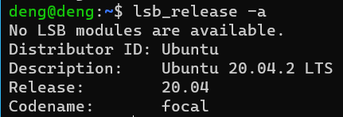

        下面展示的阿里云实验平台的虚拟机的发行版基本信息：

        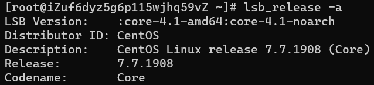

      * 方法二：**/etc/*-release 文件**

        release 文件通常被视为操作系统的标识。在 `/etc` 目录下放置了很多记录着发行版各种信息的文件，每个发行版都各自有一套这样记录着相关信息的文件。 具体命令如下展示：

        ```shell
        cat /etc/issue
        cat /etc/issue.net
        cat /etc/lsb-release
        cat /etc/os-release
        ```

        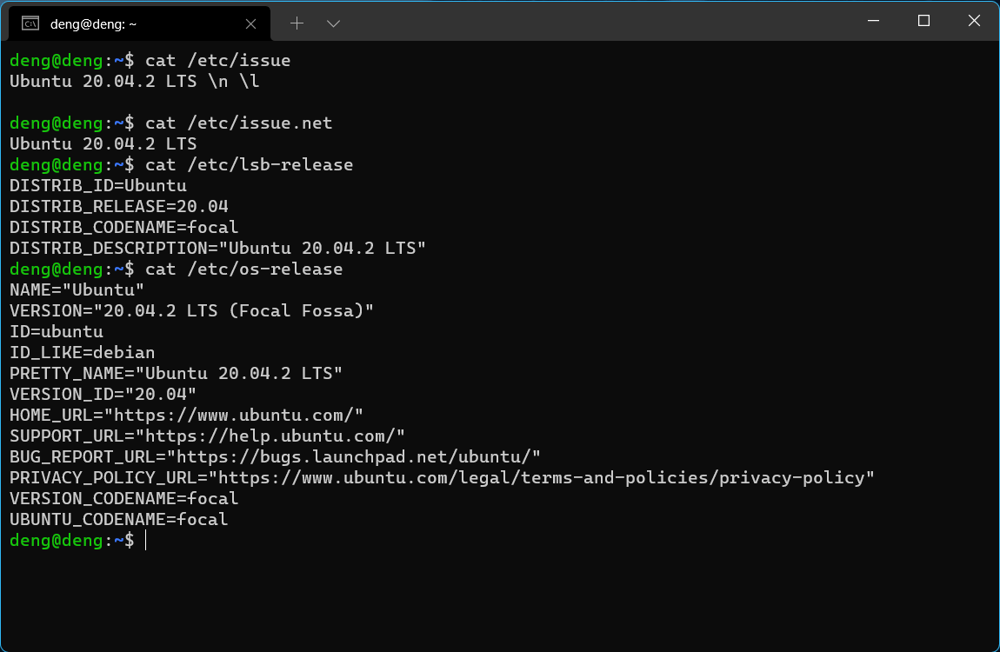

        阿里云实验平台所使用的是centos，这与ubuntu系统有一点点的不同，具体命令展示如下：

        ```shell
        cat /etc/centos-release
        cat /etc/os-release
        cat /etc/redhat-release
        cat /etc/system-release
        ```

        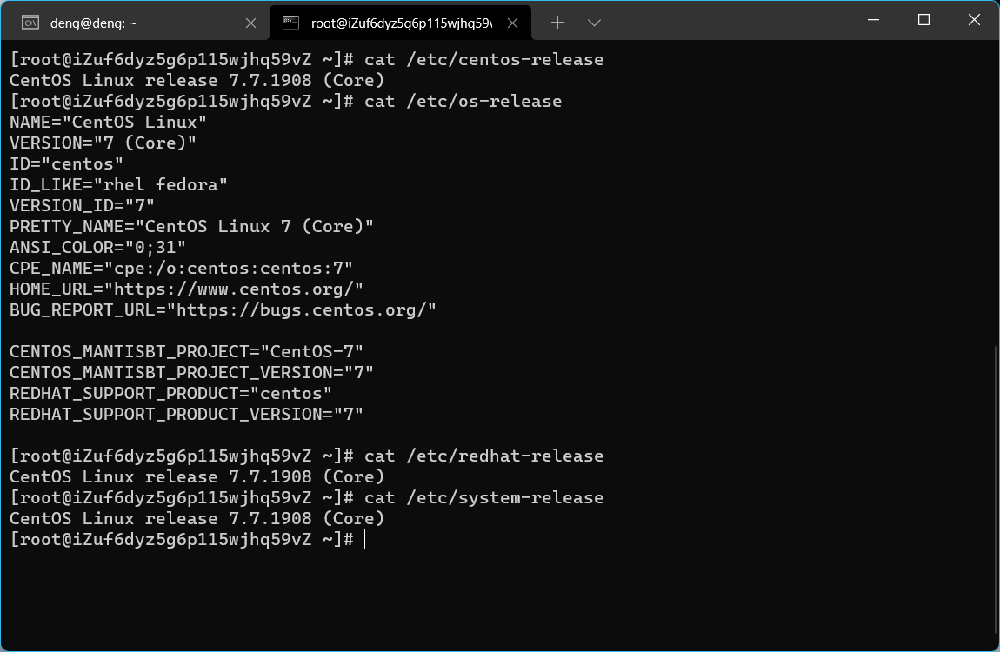

   2. ##### 当前 Linux 内核版本信息

      * **uname 命令**：在命令行直接输入`uname -a`即可查看 当前 Linux 内核版本信息。下面展示本地虚拟机的内核版本信息：

        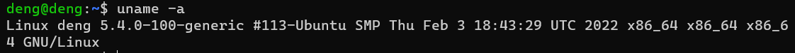

        下面展示阿里云实验平台的 Linux 内核版本信息：

        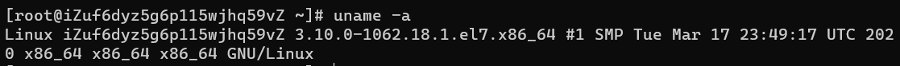

2. #### VMware Workstation 安装完 Ubuntu 之后新添加的网卡如何实现系统开机自动启用和自动获取 IP？

   首先输入在安装时添加两块网卡，一张选择NAT模式，另一张选择仅主机模式即可。

   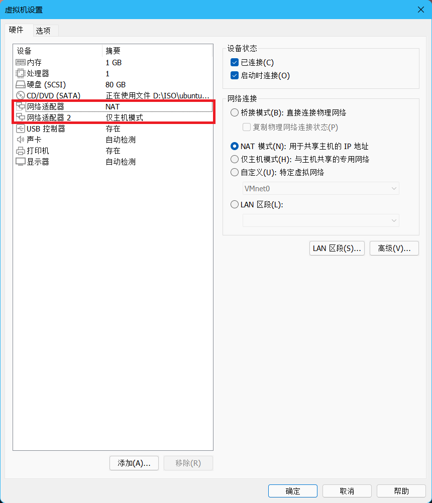

   输入`ip a`查询当前网络情况

   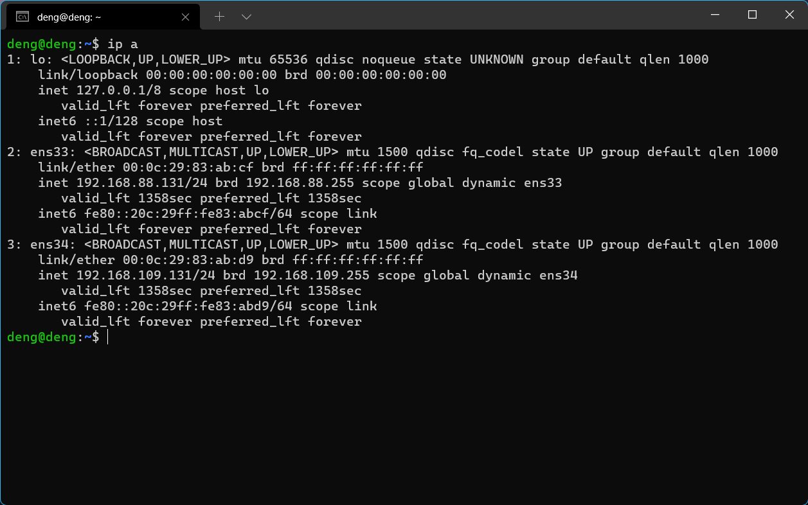

   发现两块网卡都正常工作，在ubuntu20.04.02中不需要再单独配置网卡。

3. #### 如何使用 `scp` 在「虚拟机和宿主机之间」、「本机和远程 Linux 系统之间」传输文件？

   1. **在虚拟机和宿主机之间使用`scp`传输文件**

      * **传输单个文件**

        在windows主机上创建一个test.txt文件作为测试，使用scp将这个文件传输到虚拟机中，使用命令`scp C:/Users/22487/Desktop/test.txt deng@192.168.88.131:/home/deng/others`

        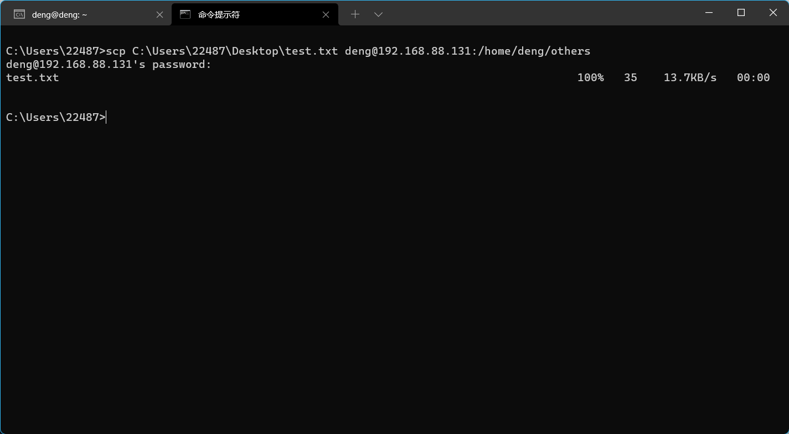

        在虚拟机中查看一下，使用`sudo vim others`即可查看others文件

        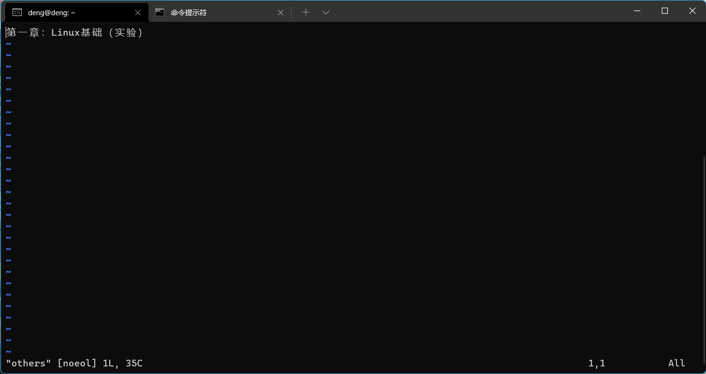

      * **传输文件夹**

        传输文件夹要使用递归复制整个目录。需要使用`scp -r`命令，先在windows主机上建立一个test文件夹 ，使用命令`scp -r C:/Users/22487/Desktop/test deng@192.168.88.131:/home/deng/test`

        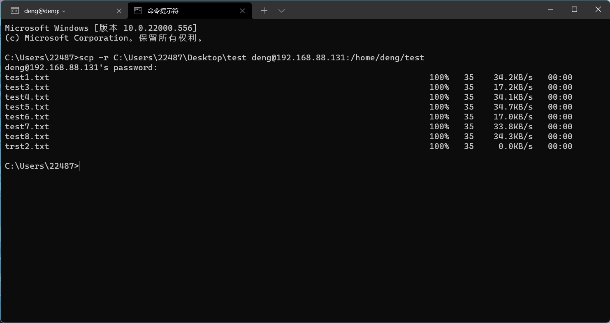

        在虚拟机中查看一下，使用命令`ls -lR test`

        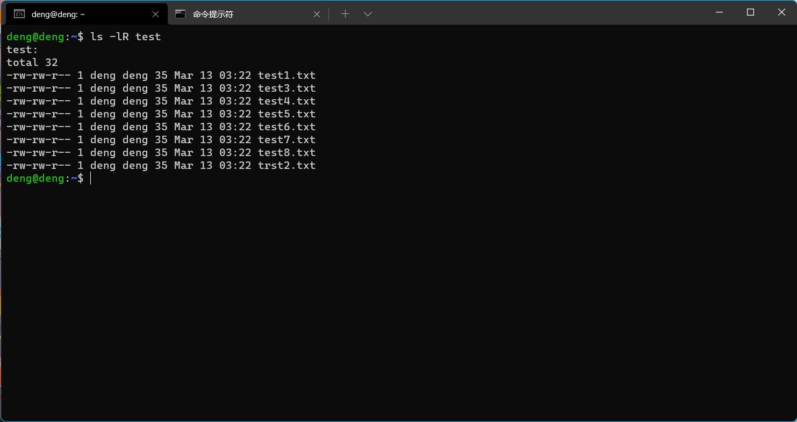

        发现已经全部传输进虚拟机了。

   2. **在本机和远程 Linux 系统之间使用`scp`传输文件**

      * **传输单个文件**

        首先在阿里云中创建一个虚拟机，使用ssh远程连接，还是将刚才创建的test.txt上传到阿里云的虚拟机，在本地终端使用命令

        `scp C:/Users/22487/Desktop/test.txt root@101.133.149.174:/root/others `

        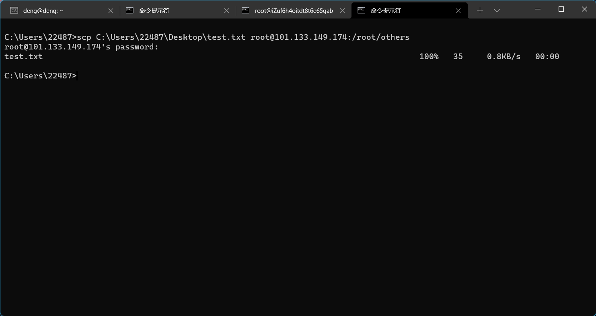

        同样在虚拟机中查看一下，使用命令`sudo vim others`

        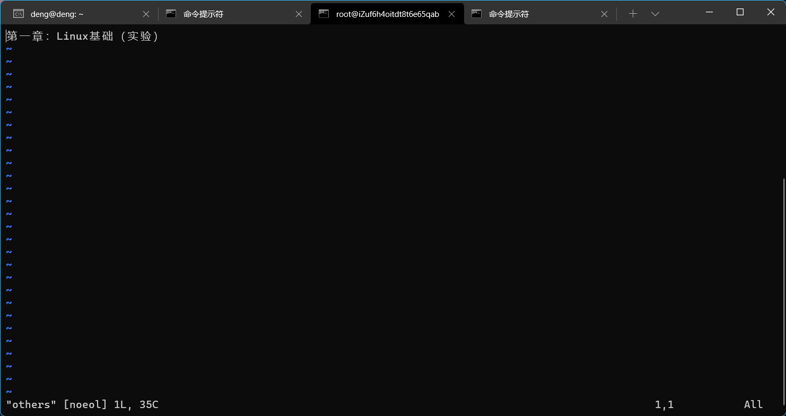

      * **传输文件夹**

        同样将刚才创建的test文件夹传输到阿里云的虚拟机上，使用命令

        `scp -r C:/Users/22487/Desktop/test root@101.133.149.174:/root/test `

        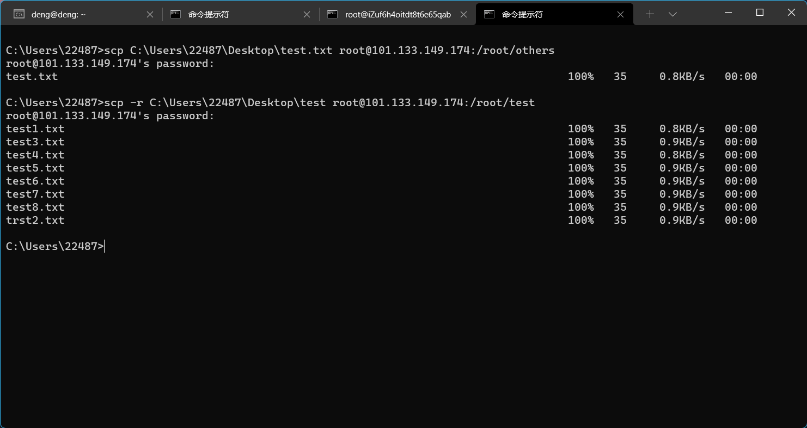

        在虚拟机中查看一下，使用命令`ls -lR test`

        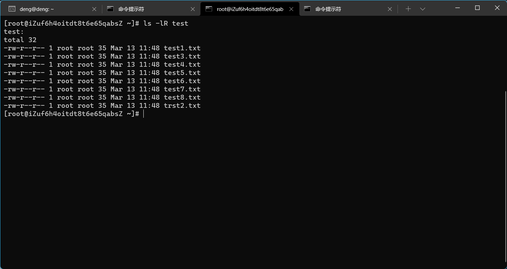

        已经全部传输到虚拟机上了。

4. #### 如何配置 SSH 免密登录？

   * **使用git bash免密登录**

     首先使用`ssh-keygen`生成公私钥，我之前已经生成过，在此就不展示了。它会生成id_rsa和id_rsa.pub两个文件，然后使用`ssh-copy-id -i ~/.ssh/id_rsa.pub deng@192.168.88.131  `将公钥即id_rsa.pub上传至服务器即可

     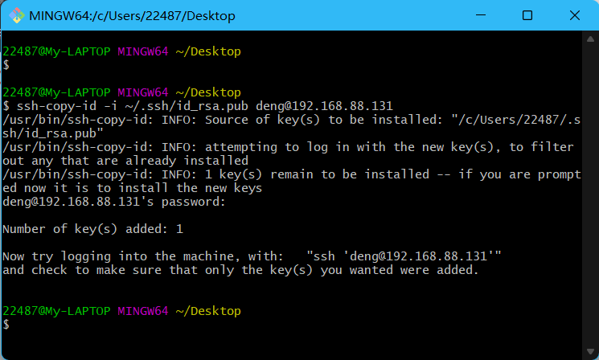

     再次在git bash中输入`ssh deng@192.168.88.131`即可实现免密登录。

     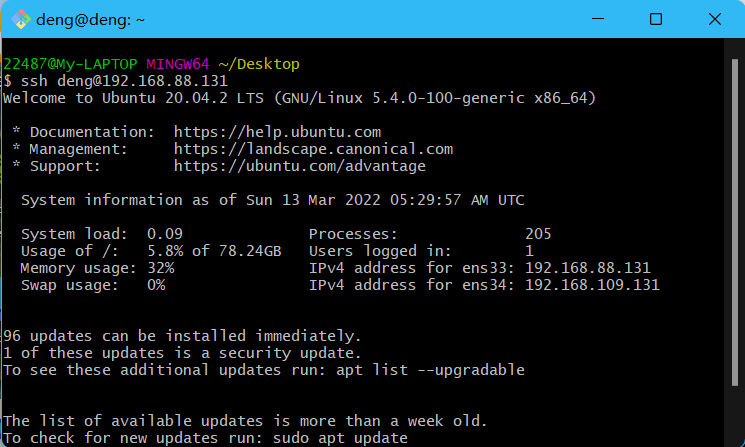

   * **使用cmd实现免密登录**

     首先还是使用`ssh-keygen`生成公私钥，我已经生成过就不再展示了。

     在C:/Users/Username//.ssh路径下创建config文件，并在文件中写上如下内容

     ```shell
     # Host后建议写你的服务器名字
     Host deng
     # HostName就是你的服务器IP
     HostName 192.168.88.131
     # User就是登陆时的用户名
     User deng
     PreferredAuthentications publickey
     # IdentityFile是本地文件的路径
     IdentityFile C:/Users/22487/.ssh/id_rsa
     ```

     接着使用`scp C:/Users/22487/.ssh/id_rsa.pub deng@192.168.88.131:/deng/.ssh`将公钥上传至服务器。

     上传完成后使用`systemctl restart sshd`命令重启服务器的ssh服务即可

     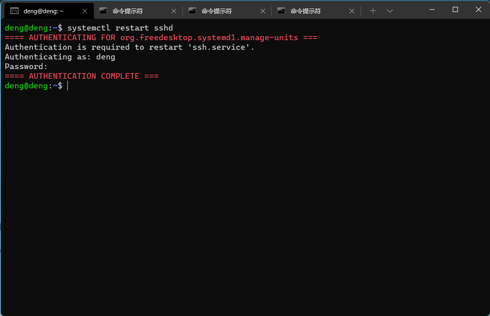

     重启cmd，并在cmd中输入`ssh deng@192.168.88.131`即可实现免密登录。

     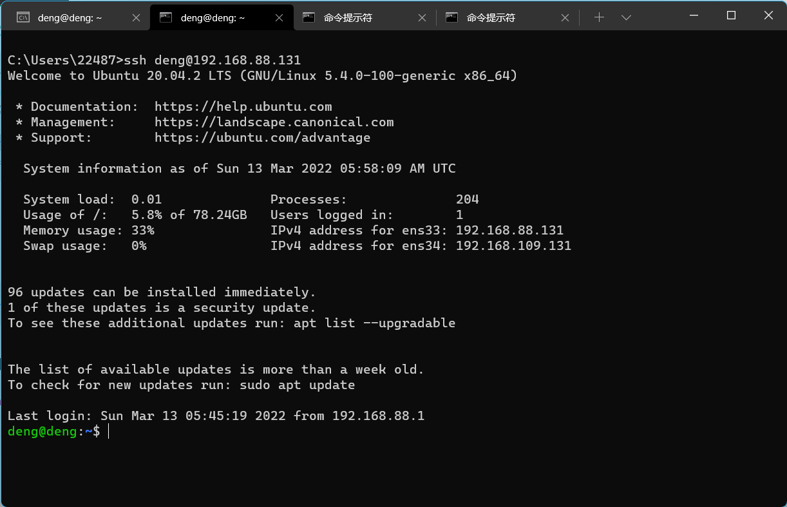


### 参考资料

[查看 Linux 发行版名称和版本号的 8 种方法](https://linux.cn/article-9586-1.html)

[6 Methods to check the Linux Kernel version running on your system](https://www.2daygeek.com/check-find-determine-running-installed-linux-kernel-version/)

[Linux scp命令](https://www.runoob.com/linux/linux-comm-scp.html)

[SSH 三步解决免密登录](https://blog.csdn.net/jeikerxiao/article/details/84105529)

[Windows系统下实现服务器SSH免密登录](https://segmentfault.com/a/1190000038657243)


