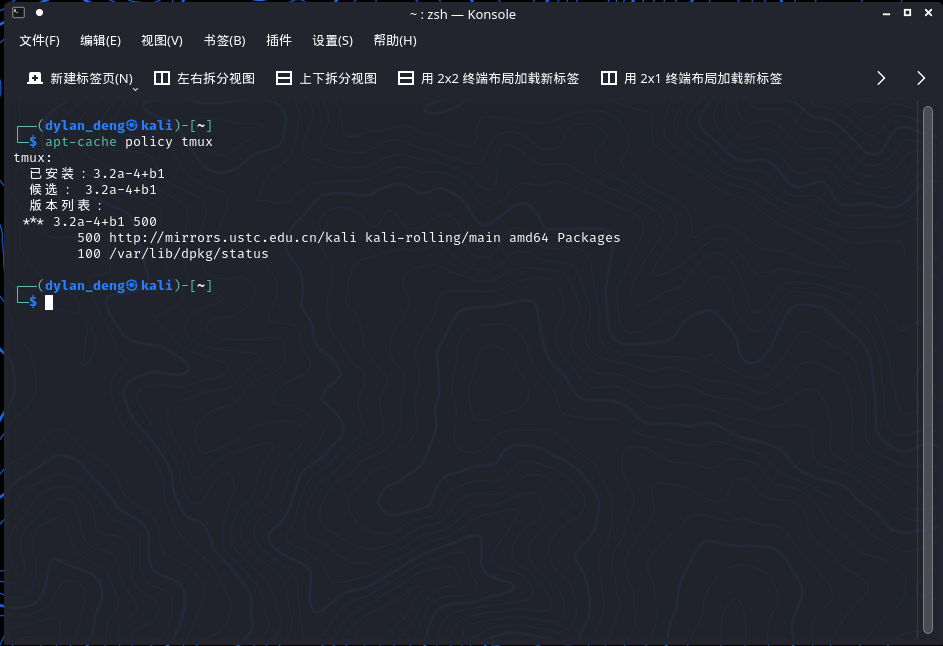
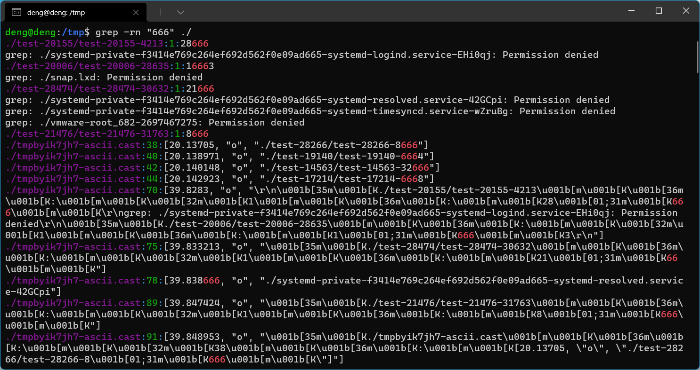

# 第二章：实验

## 实验问题:

### 使用表格方式记录至少 2 个不同 Linux 发行版本上以下信息的获取方法，使用 [asciinema](https://asciinema.org/) 录屏方式「分段」记录相关信息的获取过程和结果

* ####【软件包管理】在目标发行版上安装 `tmux` 和 `tshark` ；查看这 2 个软件被安装到哪些路径；卸载 `tshark` ；验证 `tshark` 卸载结果

* ####【文件管理】复制以下 `shell` 代码到终端运行，在目标 Linux 发行版系统中构造测试数据集，然后回答以下问题： 

  * **找到 `/tmp` 目录及其所有子目录下，文件名包含 `666` 的所有文件**
  * **找到 `/tmp` 目录及其所有子目录下，文件内容包含 `666` 的所有文件**

  ```bash
  cd /tmp && for i in $(seq 0 1024);do dir="test-$RANDOM";mkdir "$dir";echo "$RANDOM" > "$dir/$dir-$RANDOM";done
  ```

* #### 【文件压缩与解压缩】练习课件中 [文件压缩与解压缩](https://c4pr1c3.github.io/LinuxSysAdmin/chap0x02.md.html#/12/1) 一节所有提到的压缩与解压缩命令的使用方法

* ####【跟练】 [子进程管理实验](https://asciinema.org/a/f3ux5ogwbxwo2q0wxxd0hmn54)

* ####【硬件信息获取】目标系统的 CPU、内存大小、硬盘数量与硬盘容量

## 实验环境

* **VMware Workstation**

* **Ubuntu 20.04.2 LTS**
* **kali 5.10.0**

## 问题解答

1. ####【软件包管理】在目标发行版上安装 `tmux` 和 `tshark` ；查看这 2 个软件被安装到哪些路径；卸载 `tshark` ；验证 `tshark` 卸载结果

   * ##### Ubuntu 20.04.2 LTS

     1. **tmux**

        在Ubuntu 20.04.2 LTS上，使用命令

        ```bash
        sudo apt install tmux
        ```

        即可安装。安装后查看软件安装路径有两种方法，分别是`find`命令和`dpkg -L`命令，具体命令为

        ```bash
        dpkg -L tmux
        sudo find / -name tmun
        ```

        具体操作步骤如下展示：

        [](https://asciinema.org/a/29uhlUcSN1H4INoAc0YrjXXEn)

     2. **tshark**

        在Ubuntu 20.04.2 LTS上，使用命令

        ```bash
        sudo apt install tshark
        ```

        即可安装。安装后查看软件安装路径同样有两种方法，分别是`find`命令和`dpkg -L`命令，具体命令为

        ```bash
        dpkg -L tshark
        sudo find / -name tshark
        ```

        卸载安装包的命令为

        ```bash
        sudo apt purge tshark
        ```

        具体操作步骤如下展示：

        [](https://asciinema.org/a/Hkx8DRd2WjoGIoLtVOOhhcvKe)

   * ##### kali 5.10.0

     1. **tmux**

        在kali 5.10.0上已经预装过tmux，使用命令

        ```bash
        apt-cache policy tmux
        ```

        

        使用命令

        ```bash
        dpkg -L tmux
        sudo find / -name tmux
        ```

        即可查询安装包的位置，具体操作步骤如下：

        [](https://asciinema.org/a/9HQecSKI3CtQxd2RrQdTix1jR)

     2. **tshark**

        在kali 5.10.0上，使用命令

        ```bash
        sudo apt install tshark
        ```

        即可安装。安装后查看软件安装路径同样有两种方法，分别是`find`命令和`dpkg -L`命令，具体命令为

        ```bash
        dpkg -L tshark
        sudo find / -name tshark
        ```

        卸载安装包的命令为

        ```bash
        sudo apt purge tshark
        ```

        具体操作步骤如下展示：

        [](https://asciinema.org/a/rrkih2XN7aVL51EU8GGjkSEQ5)

2. #### 【文件管理】复制以下 `shell` 代码到终端运行，在目标 Linux 发行版系统中构造测试数据集，然后回答以下问题：

   - **找到 `/tmp` 目录及其所有子目录下，文件名包含 `666` 的所有文件**
   - **找到 `/tmp` 目录及其所有子目录下，文件内容包含 `666` 的所有文件**

   1. **Ubuntu 20.04.2 LTS**

      ```bash
      cd /tmp && for i in $(seq 0 1024);do dir="test-$RANDOM";mkdir "$dir";echo "$RANDOM" > "$dir/$dir-$RANDOM";done
      ```

      使用如上命令建立测试文件，

      使用命令

      ```bash
      sudo find ./ -name "*666*"
      ```

      来找到 `/tmp` 目录及其所有子目录下，文件名包含 `666` 的所有文件。

      使用命令

      ```bash
      sudo grep -rn "666" ./ --exclude=*.cast
      ```

      来找到 `/tmp` 目录及其所有子目录下，文件内容包含 `666` 的所有文件。

      在使用`asciinema`录屏时，会在当前文件下生成`*.cast`文件影响最终的输出

      

      所以需要使用`--exclude=*.cast`将`asciinema`生成的文件排除在外，具体操作步骤如下

      [](https://asciinema.org/a/tHx9sf6LycvwHf1MbYOh6EWOc)

   2. **kali 5.10.0**

      ```bash
      cd /tmp && for i in $(seq 0 1024);do dir="test-$RANDOM";mkdir "$dir";echo "$RANDOM" > "$dir/$dir-$RANDOM";done
      ```

      同样使用上述命令生成文件

      使用命令

      ```bash
      sudo find ./ -name "*666*"
      ```

      来找到 `/tmp` 目录及其所有子目录下，文件名包含 `666` 的所有文件。

      使用命令

      ```bash
      sudo grep -rn "666" ./ --exclude=*.cast
      ```

      来找到 `/tmp` 目录及其所有子目录下，文件内容包含 `666` 的所有文件。

      以下为具体操作步骤

      [](https://asciinema.org/a/5UgOO5cbXuEEwPCoO4AXBgCBO)

3. ####【文件压缩与解压缩】练习课件中 [文件压缩与解压缩](https://c4pr1c3.github.io/LinuxSysAdmin/chap0x02.md.html#/12/1) 一节所有提到的压缩与解压缩命令的使用方法

   1. **Ubuntu 20.04.2 LTS**

      `zip`，`7z`，`rar`需要提前安装，执行命令

      ```bash
      sudo apt install zip
      sudo apt install p7zip-full
      sudo apt install rar
      ```
      具体操作步骤如下展示

      [](https://asciinema.org/a/81SaFoFTI3VEMsiZOWooyMG1L)

   2. **kali 5.10.0**

      具体操作步骤如下

      [](https://asciinema.org/a/GjAhIeKP8feQ0UV9OMyP3RfMy)

4. #### 【跟练】 [子进程管理实验](https://asciinema.org/a/f3ux5ogwbxwo2q0wxxd0hmn54)

   1. **Ubuntu 20.04.2 LTS**

      具体操作步骤如下

      [](https://asciinema.org/a/Rli31AXbySFu8mYPghfMwApWg)

   2. **kali 5.10.0**

      具体操作步骤如下

      [](https://asciinema.org/a/70EzHK93uA5NVa8lL6RJMI4xA)

5. ####【硬件信息获取】目标系统的 CPU、内存大小、硬盘数量与硬盘容量

   `lshw`可以显示详细的硬件信息，使用`lshw -short`可以通过概要的方式显示硬件信息

   1. **Ubuntu 20.04.2 LTS**

      [](https://asciinema.org/a/ZKzwbxdZ5fWoF84zjejTSqM8N)

   2. **kali 5.10.0**

      [](https://asciinema.org/a/iOs6udkJBOvdFR790JN4FBLod)

      

## 参考资料

[Linux tar命令之--exclude参数 排除指定的文件或目录](https://www.cnblogs.com/bluestorm/p/10783813.html)

[ubuntu查看硬件信息](https://developer.aliyun.com/article/253789)

