# 第四章实验：shell脚本编程基础

## 实验问题

* **用bash编写一个图片批处理脚本，实现以下功能：**

  - [x]  支持命令行参数方式使用不同功能
  - [x] 支持对指定目录下所有支持格式的图片文件进行批处理
  - 支持以下常见图片批处理功能的单独使用或组合使用 
    - [x]  支持对jpeg格式图片进行图片质量压缩
    - [x] 支持对jpeg/png/svg格式图片在保持原始宽高比的前提下压缩分辨率
    - [x] 支持对图片批量添加自定义文本水印
    - [x] 支持批量重命名（统一添加文件名前缀或后缀，不影响原始文件扩展名）
    - [x] 支持将png/svg图片统一转换为jpg格式图片
* **用bash编写一个文本批处理脚本，对以下附件分别进行批量处理完成相应的数据统计任务 :**

  * [2014世界杯运动员数据](https://c4pr1c3.github.io/LinuxSysAdmin/exp/chap0x04/worldcupplayerinfo.tsv) 

    - [x] 统计不同年龄区间范围（20岁以下、[20-30]、30岁以上）的球员**数量**、**百分比**
    - [x] 统计不同场上位置的球员**数量**、**百分比**
    - [x] 名字最长的球员是谁？名字最短的球员是谁？
    - [x] 年龄最大的球员是谁？年龄最小的球员是谁？
* **用bash编写一个文本批处理脚本，对以下附件分别进行批量处理完成相应的数据统计任务：**
  * [Web服务器访问日志](https://c4pr1c3.github.io/LinuxSysAdmin/exp/chap0x04/web_log.tsv.7z) 
    - [x] 统计访问来源主机TOP 100和分别对应出现的总次数
    - [x] 统计访问来源主机TOP 100 IP和分别对应出现的总次数
    - [x] 统计最频繁被访问的URL TOP 100
    - [x] 统计不同响应状态码的出现次数和对应百分比
    - [x] 分别统计不同4XX状态码对应的TOP 10 URL和对应出现的总次数
    - [x] 给定URL输出TOP 100访问来源主机

## 实验环境

* VMware Workstation
* Ubuntu 20.04.2 LTS
* Visual Studio Code

## 实验解答

代码具体执行情况可见我的[travis-ci](https://app.travis-ci.com/github/CUCCS/2022-linux-public-Lime-Cocoa)

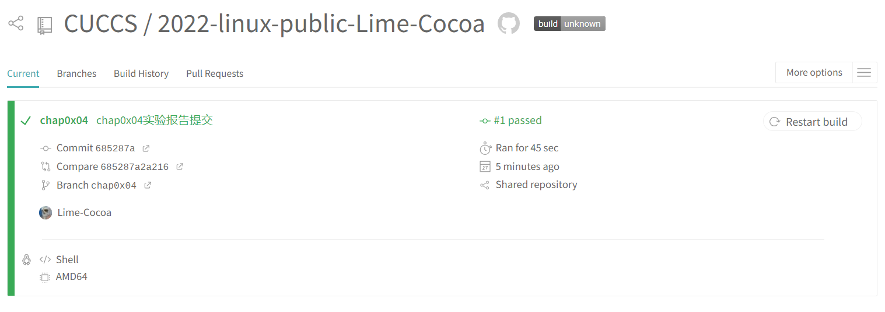

1. 用bash编写一个图片批处理脚本，实现以下功能：

   首先安装安装图像处理工具`imagemagick`，因为本次实验主要在`VSCode`中操作，所以就不需要在虚拟机中安装`shellcheck`，只需在`VSCode`中配置好相关插件即可。

   ```bash
   sudo apt update
   sudo apt install imagemagick
   ```

   接着上传实验所需要的素材，`a.png`、` b.jpeg`、`c.svg`。

   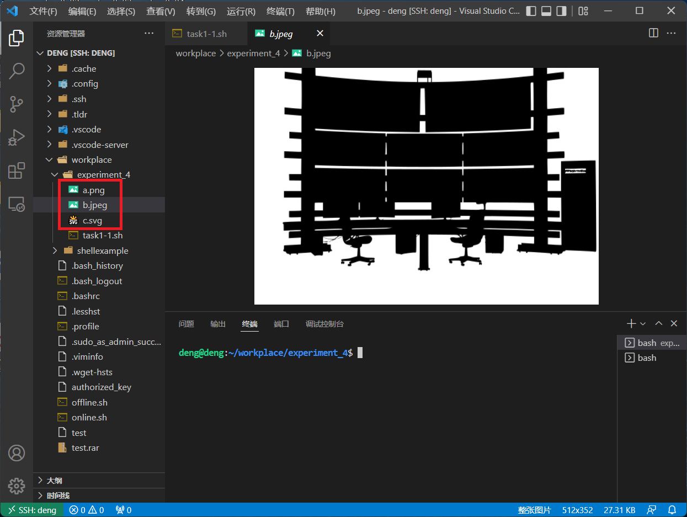

   编写[`task1.sh`](shell/task1.sh)，通过命令行参数方式使用不同功能

   ```bash
   -q Q                     ----进行图片质量压缩
   -r R                     ----对jpeg/png/svg格式图片在保持原始宽高比的前提下压缩成R分辨率
   -w font_size text color  ----对图片批量添加自定义文本水印
   -p text                  ----统一添加文件名前缀，不影响原始文件扩展名
   -s text                  ----统一添加文件名后缀，不影响原始文件扩展名
   -t                       ----将png/svg图片统一转换为jpg格式图片
   -h                       ----帮助文档
   ```

   * 支持对jpeg格式图片进行图片质量压缩

     ```bash
     #convert filename1 -quality Q filename2
     function QualityCompression {
         Q="$1" #获取质量因子
         for i in *; do
             type=${i##*.} #获取文件后缀
             if [[ ${type} != "jpeg" ]];then continue;fi #判断是否为jpeg文件
             convert "${i}" -quality "${Q}" "${i}"
             echo "${i}已经进行质量压缩"
         done  
     }
     ```

   * 支持对jpeg/png/svg格式图片在保持原始宽高比的前提下压缩分辨率

     ```bash
     # convert filename1 -resize R filename2
     function ResolutionCompression {
         R="$1" #获取压缩分辨率
         for i in *; do
             type=${i##*.} #获取文件后缀
             if [[ ${type} != "jpeg" && ${type} != "png" && ${type} != "svg" ]];then continue;fi
             convert "${i}" -resize "${R}" "${i}"
             echo "${i}已经压缩为${R}分辨率"
         done
     }
     ```

   * 支持对图片批量添加自定义文本水印

     ```bash
     #convert -draw "text 0,0 'text'" -fill red -pointsize font_size -gravity NorthWest filename1 filename2
     function TextWatermark {
         font_size="$1" #获取文本大小
         text="$2" #获取文本内容
         for i in *; do
             type=${i##*.}
             if [[ ${type} != "jpeg" && ${type} != "png" && ${type} != "svg" ]];then continue;fi
             convert -draw "text 0,0 '${text}'" -fill red -pointsize "${font_size}" -gravity NorthWest "${i}" "${i}"
             echo "${i}已经加入文本水印" 
         done
     }
     ```

   * 支持批量重命名（统一添加文件名前缀或后缀，不影响原始文件扩展名）

     ```bash
     #mv filename1 filename2
     function AddPrefix {
         text="${1}"
         for i in *; do
             type=${i##*.}
             if [[ ${type} != "jpeg" && ${type} != "png" && ${type} != "svg" ]];then continue;fi
             mv "${i}" "${text}""${i}"
             echo "${i}已经添加前缀${text}"
         done
     }
     function AddSuffix {
         text="${1}"
         for i in *; do
             type=${i##*.}
             if [[ ${type} != "jpeg" && ${type} != "png" && ${type} != "svg" ]];then continue;fi
             filename2=${i%.*}${text}"."${type}
             mv "${i}" "${filename2}"
             echo "${i}已经添加后缀${text}"
         done
     }
     ```

   * 支持将png/svg图片统一转换为jpg格式图片

     ```bash
     #convert xxx.png xxx.jpg
     function ConvertFormat {
         for i in *; do
             type=${i##*.}
             if [[ ${type} != "jpeg" && ${type} != "svg" ]];then continue;fi
             new_file=${i%%.*}".jpg"
             convert "${i}" "${new_file}"
             echo "${i}已经转换为jpg格式"
         done
     }
     ```
     测试结果如下：

     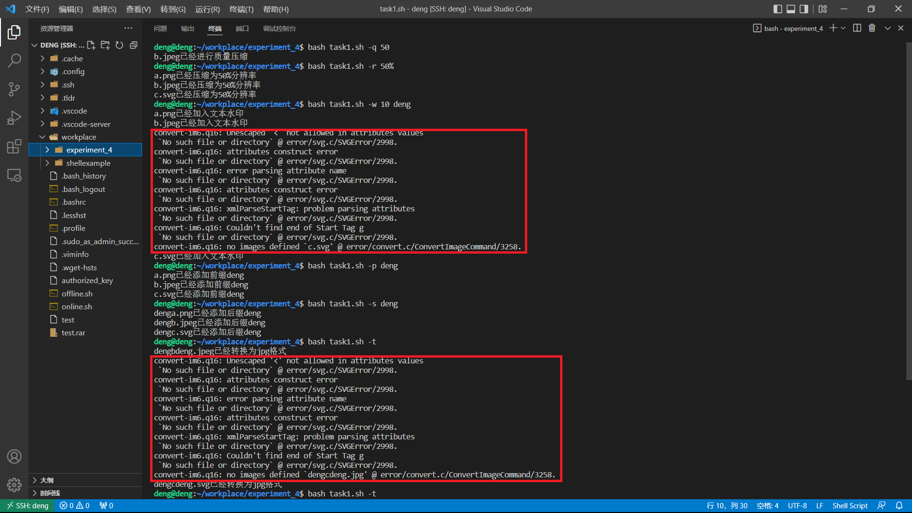

     第一次实验发现无法处理`c.svg`，经过仔细排查后发现是我本身的图片有问题，用ps重新导出后，实验正常

     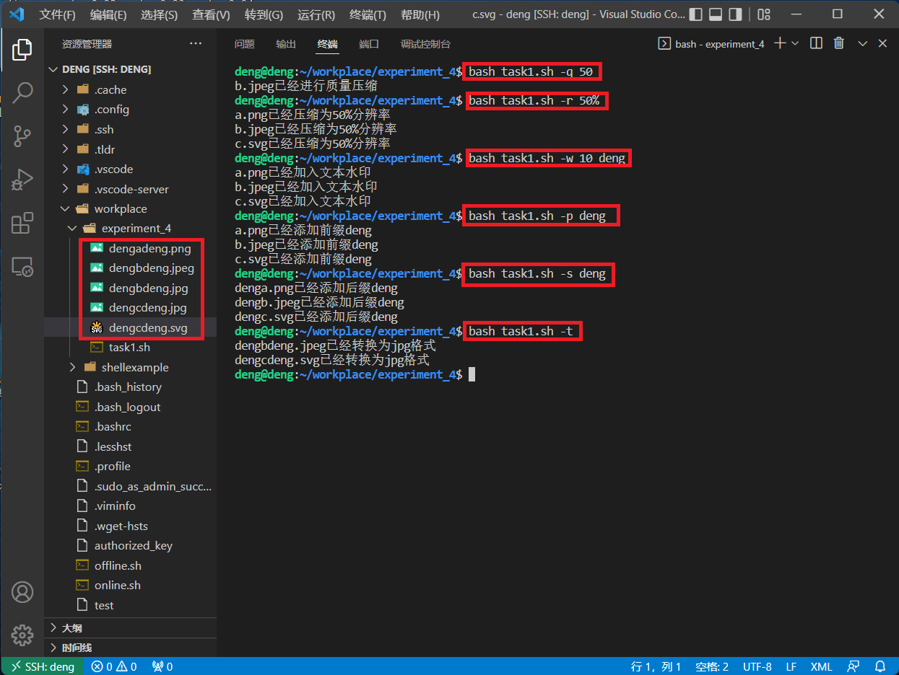

2. 用bash编写一个文本批处理脚本，对以下附件分别进行批量处理完成相应的数据统计任务 

   首先使用`wget`获取所需要的文件

   ```bash
   wget "https://c4pr1c3.github.io/LinuxSysAdmin/exp/chap0x04/worldcupplayerinfo.tsv"
   ```

   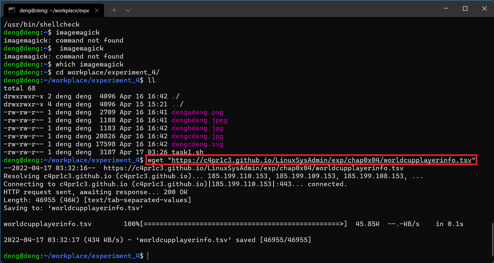

   在`VSCode`中检查一下该表格的形式，以便后续分析

   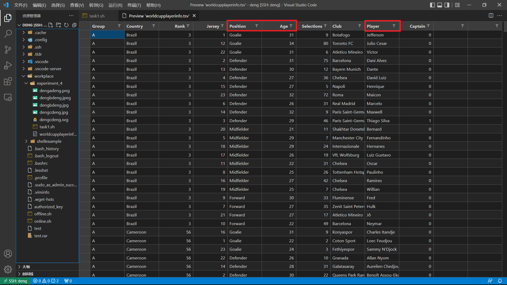

   编写[`task2.sh`](shell/task2.sh)，通过命令行参数方式使用不同功能

   ```bash
   -a                 ----统计不同年龄区间范围(20岁以下、[20-30]、30岁以上)的球员数量、百分比
   -p                 ----统计不同场上位置的球员数量、百分比
   -n                 ----统计名字最长的球员,名字最短的球员
   -m                 ----统计年龄最大的球员，年龄最小的球员
   -h                 ----帮助文档
   ```

   * 统计不同年龄区间范围(20岁以下、[20-30]、30岁以上)的球员数量、百分比

     ```bash
     function AgeRange {
         awk -F "\t" '
             BEGIN {a=0;b=0;c=0;}
             $6!="Age" {
                if($6>=0&&$6<20) {
                    a++;
                 }
                else if($6<=30) {
                    b++;
                 }
                else {
                    c++;
                 }
             }
             END {
                 sum=a+b+c;
                 printf("年龄\t数量\t百分比\n");
                 printf("<20\t%d\t%f%%\n",a,a*100/sum);
                 printf("[20,30]\t%d\t%f%%\n",b,b*100/sum);
                 printf(">30\t%d\t%f%%\n",c,c*100/sum);
             }' worldcupplayerinfo.tsv
     }
     ```

   * 统计不同场上位置的球员数量、百分比

     ```bash
     function Position {
         awk -F "\t" '
             BEGIN {sum=0;}
             $5!="Position" {
                pos[$5]++;
                sum++;
             }
             END {
                 printf("    位置\t数量\t百分比\n")
                 for(i in pos){
                     printf("%-10s\t%d\t%f%%\n",i,pos[i],pos[i]*100/sum);
                 }
             }' worldcupplayerinfo.tsv
     }
     ```

   * 统计名字最长的球员,名字最短的球员

     ```bash
     function name {
         awk -F "\t" '
             BEGIN {max=-1;min=1000;}
             $9!="Player" {
                 len=length($9);
                 name[$9]=len;
                 max=len>max?len:max;
                 min=len<min?len:min;
             }
             END {
                 for(i in name) {
                     if(name[i]==max){
                         printf("名字最长的球员是 %s\n",i);
                     }
                     else if(name[i]==min){
                         printf("名字最短的球员是 %s\n",i);
                     }
                 }
             }' worldcupplayerinfo.tsv
     }
     ```

   * 统计年龄最大的球员，年龄最小的球员

     ```bash
     function MaxMin {
         awk -F "\t" '
             BEGIN {max=-1;min=1000;}
             $6!="Age" {
                 age=$6;
                 name[$9]=age;
                 max=age>max?age:max;
                 min=age<min?age:min;
             }
             END {
                 for(i in name) {
                     if(name[i]==max){
                         printf("年龄最大的球员是 %s 他的年龄为 %d\n",i,max);
                     }
                     if(name[i]==min){
                         printf("年龄最小的球员是 %s 他的年龄为 %d\n",i,min);
                     }
                 }
             }' worldcupplayerinfo.tsv
     }
     ```

   测试结果如下：

   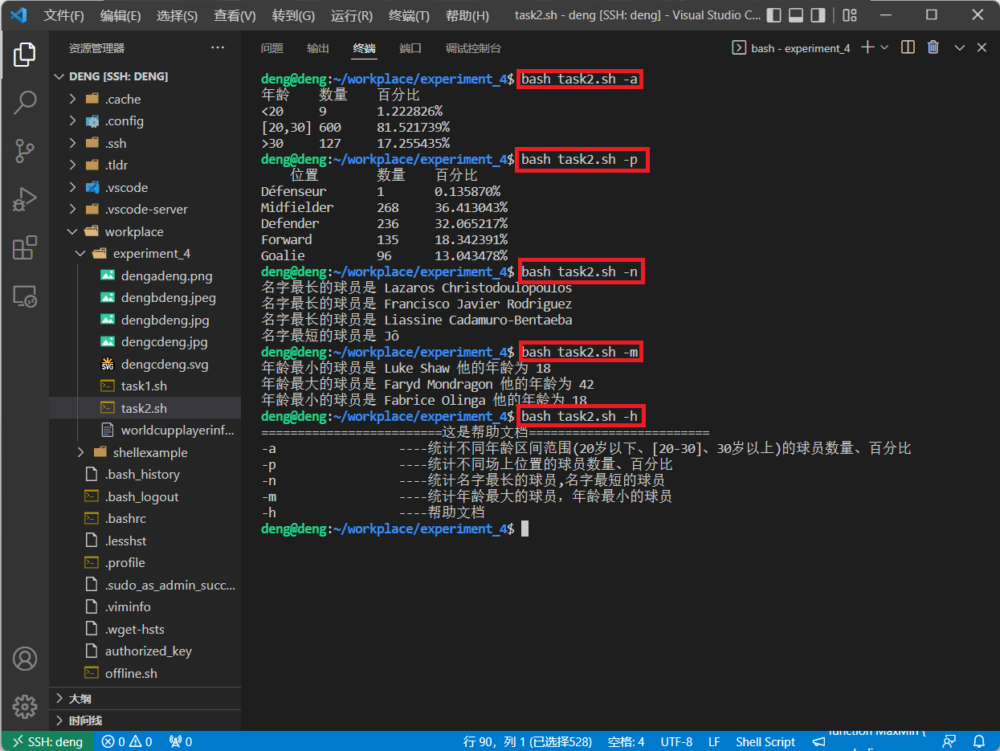

3. 用bash编写一个文本批处理脚本，对以下附件分别进行批量处理完成相应的数据统计任务

   首先使用`wget`获取所需要的文件

   ```bash
   wget "https://c4pr1c3.github.io/LinuxSysAdmin/exp/chap0x04/web_log.tsv.7z"
   ```

   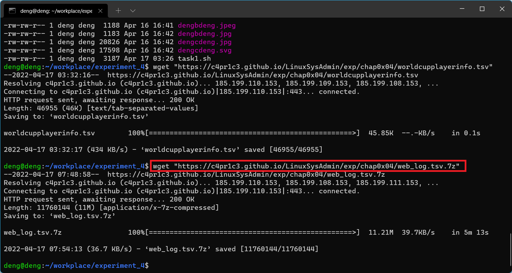

   发现是一个`7z`压缩包，因为之前已经下载过`7z`工具，对其进行解压

   ```bash
   7z x web_log.tsv.7z
   ```

   编写[`task3.sh`](shell/task3.sh)，通过命令行参数方式使用不同功能

   ```bash
   -t                 ----统计访问来源主机TOP 100和分别对应出现的总次数
   -i                 ----统计访问来源主机TOP 100 IP和分别对应出现的总次数
   -u                 ----统计最频繁被访问的URL TOP 100
   -r                 ----统计不同响应状态码的出现次数和对应百分比
   -4                 ----分别统计不同4XX状态码对应的TOP 10 URL和对应出现的总次数
   -p url             ----给定URL输出TOP 100访问来源主机            
   -h                 ----帮助文档
   ```

   * 统计访问来源主机TOP 100和分别对应出现的总次数

     ```bash
     function top100_host {
         printf "%s\t%46s\n" "top100主机名" "次数"
         awk -F "\t" '
         NR>1 {
             host[$1]++;
         }
         END {
             for(i in host){
                 printf("%-50s\t%d\n",i,host[i]);
             }
         }' web_log.tsv | sort -g -k 2 -r | head -100
     }
     ```

   * 统计访问来源主机TOP 100 IP和分别对应出现的总次数

     ```bash
     function top100_ip {
         printf "%s\t%14s\n" "top100IP地址" "次数"
         awk -F "\t" '
         NR>1 {
             if(match($1, /^[0-9]{1,3}\.[0-9]{1,3}\.[0-9]{1,3}\.[0-9]{1,3}$/)){
                 ip[$1]++;
             }
         }
         END {
             for(i in ip){
                 printf("%-20s\t%d\n",i,ip[i])
             }
         }' web_log.tsv | sort -g -k 2 -r | head -100
     }
     ```

   * 统计最频繁被访问的URL TOP 100

     ```bash
     function top100_url {
         printf "%s\t%46s\n" "top100_url" "次数"
         awk -F "\t" '
         NR>1 {
             url[$5]++;
         }
         END {
             for(i in url){
                 printf("%-50s\t%d\n",i,url[i]);
             }
         }' web_log.tsv | sort -g -k 2 -r | head -100
     }
     ```

   * 统计不同响应状态码的出现次数和对应百分比

     ```bash
     function response {
         awk -F "\t" '
         BEGIN {
             printf("状态码\t次数\t百分比\n");
         }
         NR>1 {
             response[$6]++;
         }
         END {
             for(i in response){
                 printf("%d\t%d\t%f%%\n",i,response[i],response[i]*100/(NR-1));
             }
         }' web_log.tsv
     }
     ```

   * 分别统计不同4XX状态码对应的TOP 10 URL和对应出现的总次数

     ```bash
     function 4xxresponse {
         printf "%s\t%46s\n" "状态码=403的url" "次数"
         awk -F "\t" '
         NR>1 {
             if($6==403){
                 url[$5]++;
             }
         }
         END {
             for(i in url){
                 printf("%-50s\t%d\n",i,url[i]);
             }
         }' web_log.tsv | sort -g -k 2 -r | head -10
     
          printf "%s\t%46s\n" "状态码=404的url" "次数"
         awk -F "\t" '
         NR>1 {
             if($6==404){
                 url[$5]++;
             }
         }
         END {
             for(i in url){
                 printf("%-50s\t%d\n",i,url[i]);
             }
         }' web_log.tsv | sort -g -k 2 -r | head -10
     }
     ```

   * 给定URL输出TOP 100访问来源主机

     ```bash
     function inputurl {
         printf "%s\t%45s\n" "top100主机名" "次数"
         awk -F "\t" '
         NR>1 {
             if("'"$1"'"==$5){
                 host[$1]++;
             }
         }
         END {
             for(i in host){
                 printf("%-50s\t%d\n",i,host[i]);
             }
         }' web_log.tsv | sort -g -k 2 -r | head -100
     }
     ```

   测试结果如下：

   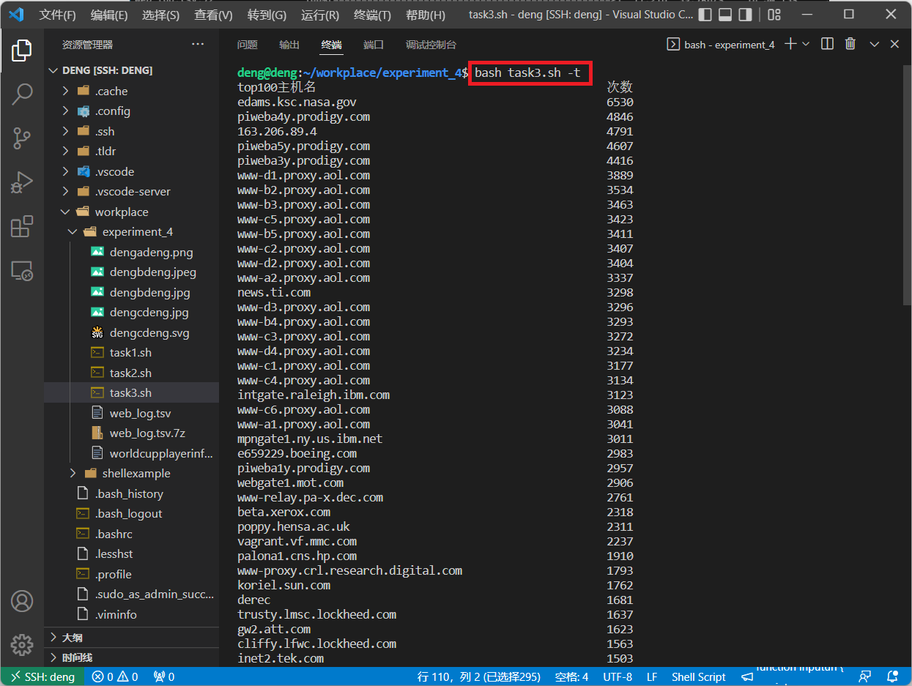

   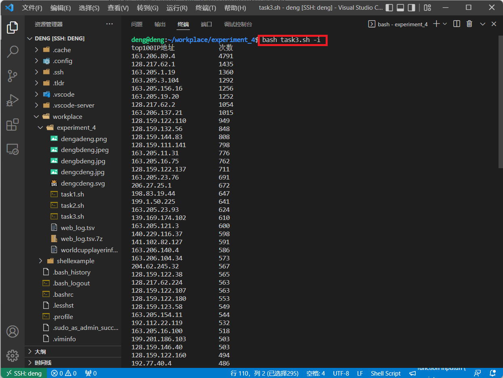

   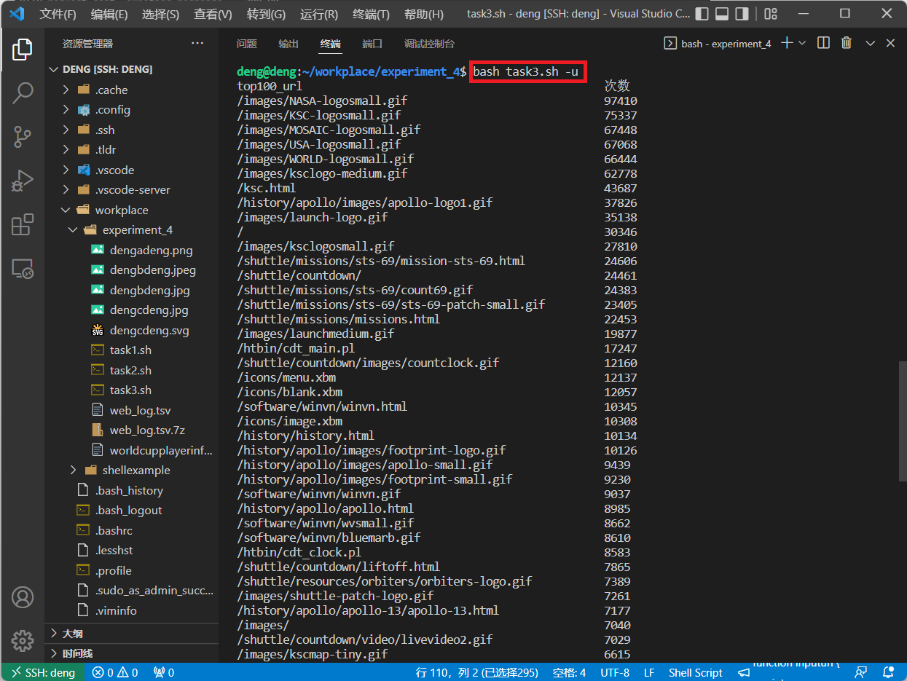

   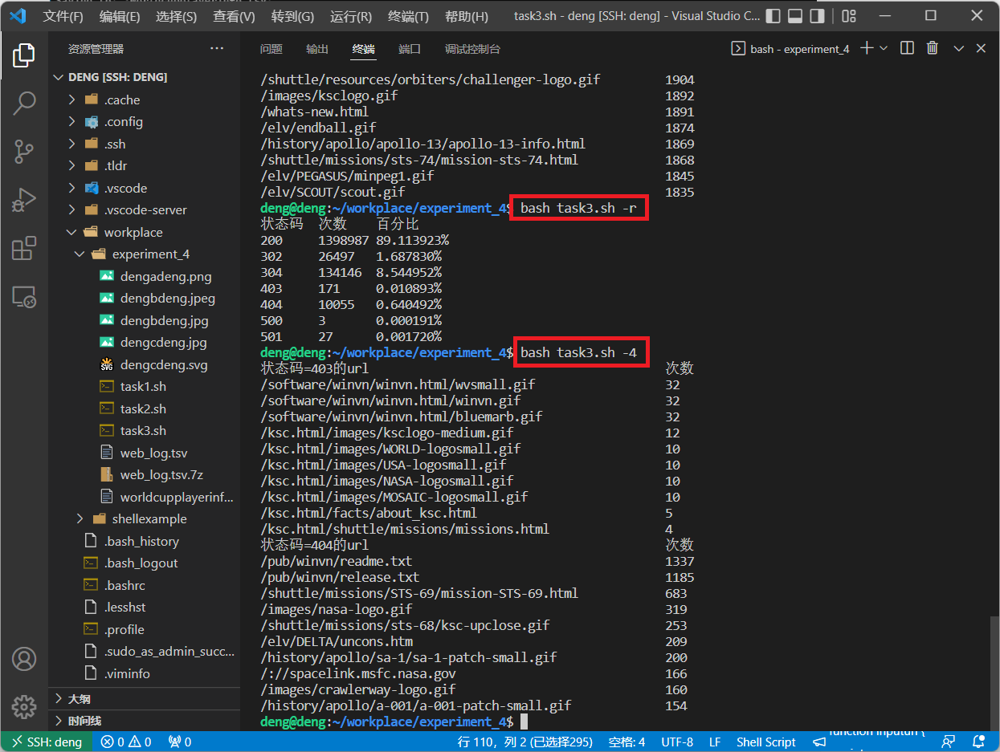

   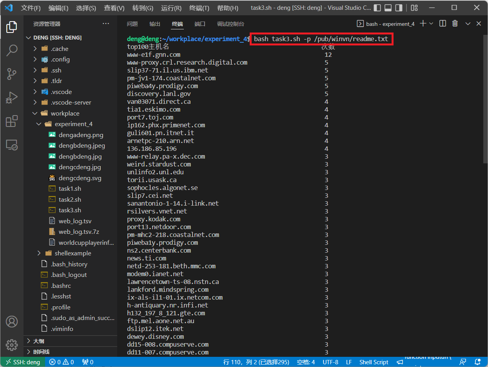

## 遇到的问题

如何将数据导出并且在`markdown`中生成表格？

在这里使用了`awk`语法，在每一行的固定地方添加`|`即可。拿`task3`中的**统计访问来源主机TOP 100和分别对应出现的总次数**来举例子，首先将输出重定向到`t.txt`文件中

```bash
bash task3.sh -t > t.txt
```

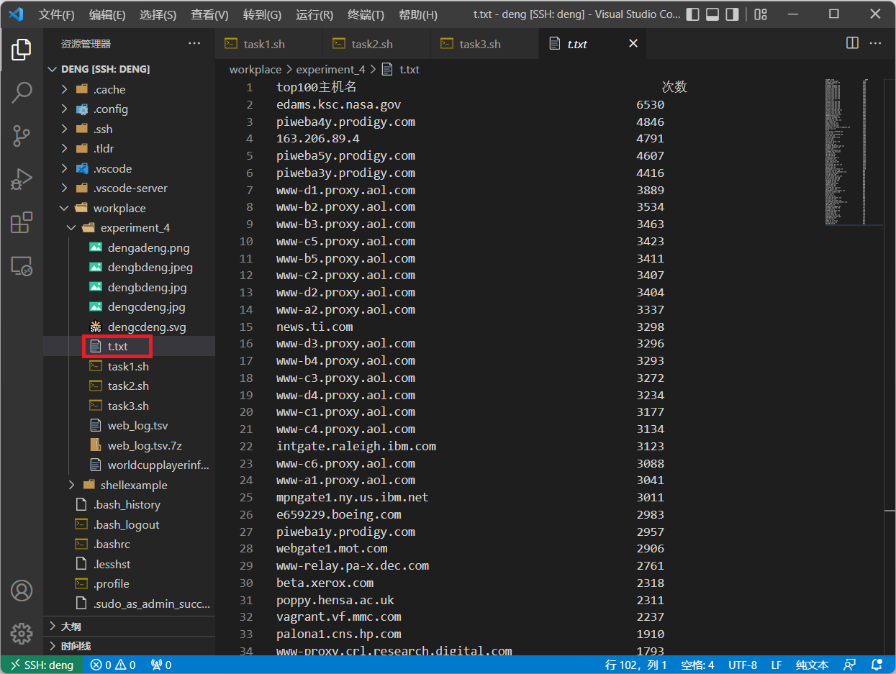

使用`awk`在第一列和第二列前后添加`|`，并且重定向到t_1.txt中

```bash
awk -F' ' '{print "| " $1 " | " $2 " |"}' t.txt > t_1.txt
```

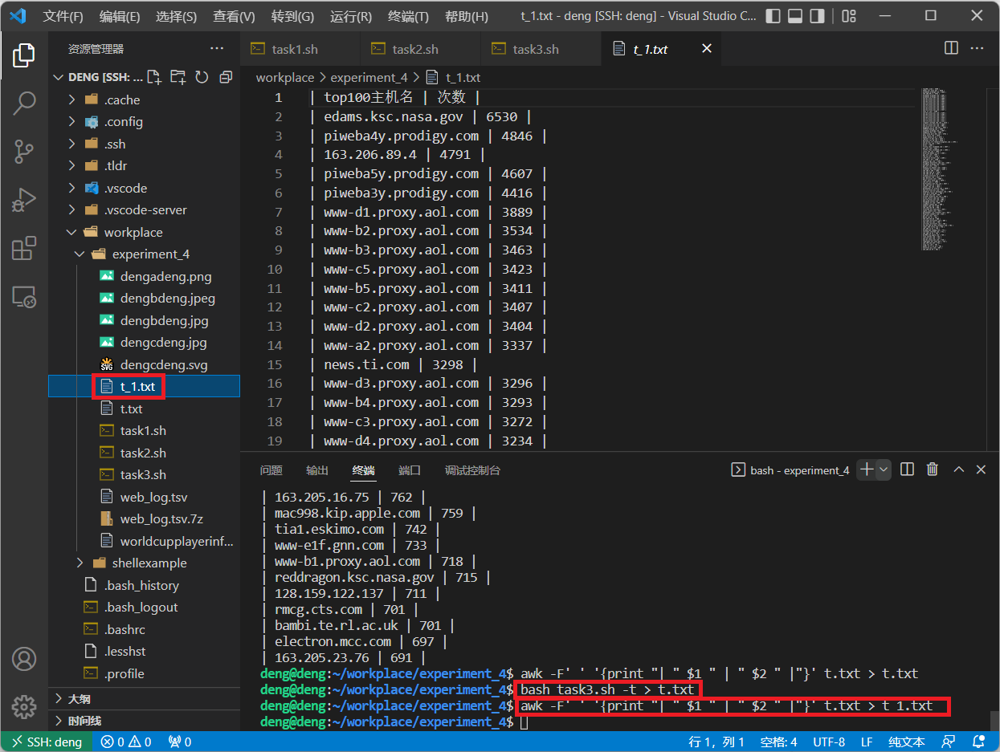

再将该文件中的内容复制到`markdown`中,并且手动添加分割线，就可以快速生成表格了。

## 参考资料

[shell获取文件拓展名](https://blog.csdn.net/RonnyJiang/article/details/52386121)

[Linux awk命令](https://www.runoob.com/linux/linux-comm-awk.html)

[awk command (performs text processing and pattern matching)](http://itdoc.hitachi.co.jp/manuals/3021/3021336210e/JPAS0323.HTM)

[正则表达式 - 语法](https://www.runoob.com/regexp/regexp-syntax.html)

